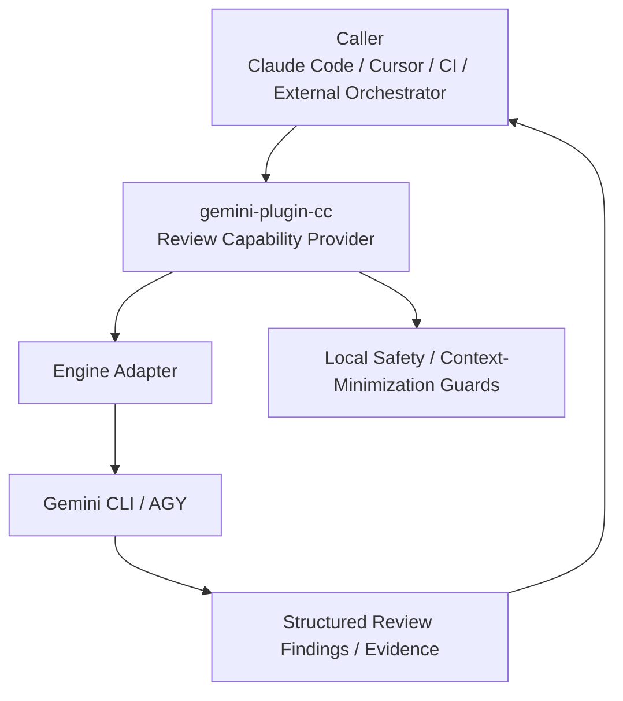
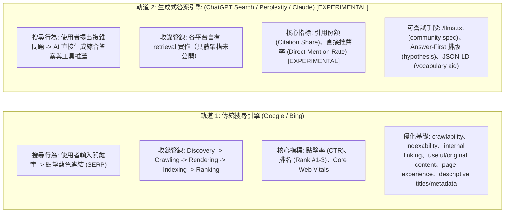
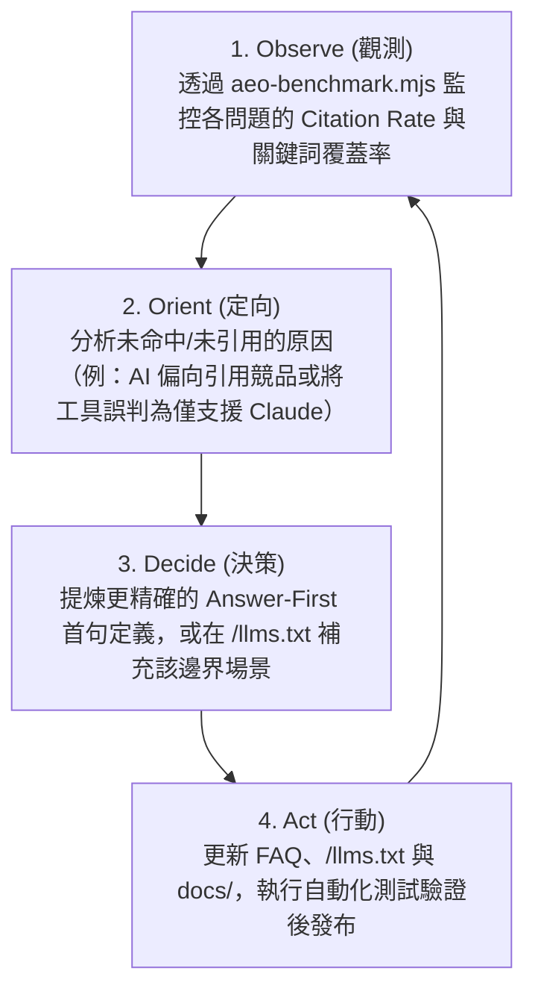

# `gemini-plugin-cc` 終極推廣、生態上架與架構交接手冊 (業界標準加固版)
(Master Playbook: Growth, MCP Registries, AI-Era SEO/AEO Architecture & Next-Gen Launch)

> **版本**：v3.8.1 (3rd Adversarial-Review Pass; Handoff-Blocking Resolved)  
> **建立日期**：2026-08-21  
> **對齊標準**：RFC 9309 (Robots Exclusion Protocol)、Answer.AI `/llms.txt` v2 community specification、OASIS SARIF 2.1.0、Schema.org SoftwareApplication & TechArticle、Google Search Central people-first content / E-E-A-T guidance、OWASP Top 10 for LLM (2025/2026)、OpenSSF Best Practices、Claude Code Manifest Spec  
> **交接目標**：供維護團隊與 **Claude Code** 進行後續無縫實作、生態登錄、AI 時代搜尋最佳化與跨客戶端維運。  

> [!IMPORTANT]
> **Repository Baseline (Snapshot)**
> ```
> repo:     arcobaleno64/gemini-plugin-cc
> commit:   22b93a7a6acfa6f7b18b7ae2b3e7774219dbbf38
> branch:   main
> verified: 2026-08-21
> plugin:   v0.22.2 (MIT)
> ```
> 本文件所有 `[CURRENT]` 宣稱以上述 commit 為準。`main` 更新後可能漂移，實作前應 `git show <SHA>:<path>` 驗證。

> [!IMPORTANT]
> **狀態標籤系統 (Status Label Convention)**
> 每個 implementation-state claim **必須顯式標籤**。**未標注者視為 `UNCLASSIFIED`，不得推定 implementation state，不得據此實作。**
>
> | 標籤 | 意義 | Claude Code 行為準則 |
> |---|---|---|
> | `[CURRENT]` | 上述 baseline commit 已驗證存在 | 可引用，但實作前仍應驗證 `main` HEAD |
> | `[PLANNED]` | 已決策但尚未實作 | **須先實作再引用**；不得假設已存在 |
> | `[EXPERIMENTAL]` | 假設、研究方向或 benchmark proposal | **不得作為實作依據**；僅供規劃參考 |
> | `[EXTERNAL-CURRENT@date]` | 引用外部平台/規格在指定日期的狀態 | 實作前須重新查證該平台現行規格 |
> | `[TEMPLATE]` | 通用 SOP 範本，佔位符須填入實際值 | 不可直接執行 |
> | *(未標注)* | **UNCLASSIFIED** | **禁止推定為 CURRENT 或據此實作** |

---

> [!WARNING]
> **這份文件是計畫，不是現況。** 它的 baseline 是 `22b93a7` / v0.22.2 / 2026-08-21，
> 而 repository 已經走遠了。第 1 節的評估矩陣、各節的 `[CURRENT]` 標記，都必須
> 在動工當天對 HEAD 重新查證，不得直接採信。
>
> **先讀 [`ROADMAP.md`](ROADMAP.md)**：那裡逐項記錄了哪些前提經查證仍成立、哪些
> 已經做掉、哪些前置條件不存在、哪些照做會出事。這份 playbook 保留下來是為了
> 它的規格與範本（robots.txt、JSON-LD、`action.yml`、SARIF），不是為了它的狀態欄。

---


## 1. 現況評估矩陣 (Current State Audit)

經代碼庫全面唯讀檢驗，專案現狀與外部平台要求的合規性如下：

| 檢驗項目 | Project Target / Ecosystem Objective | 目前現狀 | 評估結論 | Claude 實作行動 |
|---|---|---|---|---|
| **開源許可證** | **Required**: Public 倉庫需具備 `LICENSE` | 現為 MIT，v1.0.0 升級 Apache 2.0 | **過渡中** | `[PLANNED]` v1.0.0 正式切換 (見第 9 節) |
| **MCP 啟動穩定性** | **Required**: `initialize` 與 `tools/list` 不得崩潰 | `gemini-mcp.mjs` 為純記憶體回應，無啟動探測 | **部分合規** | `[CURRENT]` 無啟動時 upstream 呼叫（降低一項失敗模式），但不等於完整 MCP compliance 驗證 |
| **Smithery 設定檔** | **Optional**: Smithery 市集可見性 | 尚未建立 | ⚠️ **待補齊** | `[PLANNED]` 新增 `smithery.yaml` (見第 4.1 節) |
| **AEO 機器索引** | **Experimental**: community spec，非平台要求 | 尚未建立 | ⚠️ **待補齊** | `[PLANNED]` 實裝 `/llms.txt` 與建置腳本 (見第 4.6 節) |
| **AI 爬蟲權限** | **Optional**: RFC 9309 crawling preference 表達 | 尚未發布 | ⚠️ **待配置** | `[PLANNED]` 部署 `robots.txt` (見第 4.5 節) |
| **語意實體圖譜** | **Optional**: Schema.org vocabulary aid | 尚未嵌入 | ⚠️ **待補齊** | `[PLANNED]` 嵌入 JSON-LD 標記 (見第 4.7 節) |
| **模型命名邊界** | **Required**: 支援 Vertex AI (`/`) 與版本標籤 (`@`) | 舊正則阻斷了 `/` 與 `@` | ⚠️ **待放寬** | `[PLANNED]` 更新 `SAFE_MODEL_ID` (見第 6.2 節) |
| **Gate 安全合規** | **Required** (CI): CI/CD 環境需支援 Fail-Closed | 現狀為全域 Fail-Open | ⚠️ **待雙軌化** | `[PLANNED]` 引入 `GEMINI_GATE_STRICT` (見第 6.1 節) |
| **CI 封裝標準** | **Optional**: 企業流水線 1-line 啟用 | 尚無 `action.yml` | ⚠️ **待補齊** | `[PLANNED]` 新增 `action.yml` (見第 7.1 節) |
| **漏洞輸出標準** | **Optional**: OASIS SARIF 2.1.0 格式 | 現狀為自訂 JSON | ⚠️ **待支援** | `[PLANNED]` 擴充 SARIF 輸出 (見第 7.2 節) |

---

## 2. 專案核心定位與邊界 (Core Positioning & Boundary)

> **本節只定義 `gemini-plugin-cc` 本身。**
> `gemini-plugin-cc` 是可被 Claude Code、Cursor、CI 或其他 orchestrator 呼叫的 **Gemini / AGY capability provider**；
> 它不擁有上層 multi-agent orchestration、finding adjudication 或 release authority。
> Triad-Flow 的角色分工、Evidence Contract、Codex verification lens 與 deterministic release policy 已移至獨立架構文件，不在本文件重複定義。



* **核心責任**：
  1. **Engine abstraction**：封裝 Gemini CLI / AGY 的版本、模型、認證與 capability 差異。
  2. **Review harness**：提供 pragmatic review、adversarial review、rescue/job lifecycle 等穩定入口。
  3. **Structured evidence**：將 review 結果輸出為可供上層系統消費的 JSON / SARIF 等格式，而不是自行決定最終 release verdict。
  4. **Safety boundary**：最小化 plugin 主動組裝的 context、避免已知敏感檔案路徑被納入 payload，並清楚揭露底層 agentic CLI 並非 filesystem sandbox。
  5. **Integration surfaces**：支援 Claude Code plugin、MCP、CLI 與 CI/CD 等呼叫介面。

* **明確 Non-Goals**：
  - 不在本插件內實作通用 multi-agent workflow engine。
  - 不以模型投票或 `max severity` 自動建立 finding authority。
  - 不把 Gemini/AGY 宣稱為強制 filesystem sandbox。
  - 不讓本插件成為上層系統不可替換的 orchestration hard dependency。
  - 不在本文件定義 Triad-Flow 的 Claude / Codex / Gemini 全域角色與 release policy。

* **與 Triad-Flow 的關係**：
  - `gemini-plugin-cc` 可作為 Triad-Flow 的 Gemini-side adapter / capability provider。
  - 兩者只透過薄的 request/result/evidence contract 對接。
  - Triad-Flow 可獨立演進；本插件亦可獨立發版。

---

## 3. 三大生態推進路徑與申報指引

### 3.1 登上 Anthropic 官方推薦 / 插件目錄
* **論述核心**：本插件旨在降低送往外部模型的上下文範圍，並對已知機密檔案路徑實施 filename-based redaction。Review payloads 可能包含 git status、diffs 與符合條件的 untracked file 內容。底層 Gemini/AGY CLI 為 agentic 且非 path-sandboxed，可能獨立讀取工作區中的其他檔案。詳見 `PRIVACY.md`。
* **交付物**：`SECURITY.md` `[CURRENT]` 已建立（含 private advisory、email、48 hr initial response SLA、7 business days status update）。

### 3.2 申請 OpenAI Codex for Open Source 資助 ([申請入口](https://openai.com/form/codex-for-oss/)) `[EXTERNAL-CURRENT@2026-08]`
* **官方審核本質**：面向公開開源倉庫維護者。入選 signals 包括 active maintenance、meaningful usage、broad adoption、ecosystem importance。入選資源包括 ChatGPT Pro（6 個月）、API credits、conditional Codex Security access。
* **申請表最佳填寫範本**：
  * **Role**: Primary Maintainer of `gemini-plugin-cc`.
  * **Project Description**: An open-source multi-agent code review & adversarial consensus framework for developer workflows, originating from the `codex-plugin-cc` lineage.
  * **Intended Use of API Credits**:
    1. 在開源倉庫的 CI/CD 中運行 `gemini-plugin-cc` 異質外部審查，並以結構化 evidence 供上層 orchestrator 或人工 reviewer 驗證。
    2. 建置開放的《開源代碼審查基準 (Open-Source Multi-Agent Review Benchmark)》，評測異質模型協同降低 CVE 漏洞率的成效。
  * **Adoption Evidence**（建議補充）：提供 GitHub stars/forks/clones 增長趨勢、issue/PR 活動量、下游整合實例等**實際使用者採用證據**，而非僅描述架構。評審關注專案對 OSS 生態的實際價值。

---

## 4. MCP 市集、跨客戶端與 AI 時代 SEO / AEO 全方位實裝指南

### 4.1 Smithery.ai 登錄設定 (`smithery.yaml`) `[PLANNED]`

> [!WARNING]
> **Schema 需重新驗證** `[EXTERNAL-CURRENT@2026-08]`
> 以下範例基於早期 Smithery stdio config 格式。Smithery 目前可能已轉向 `configSchema` / `commandFunction` 模式以及 **MCPB bundle** 發布路徑。實作前須以 Smithery 當前 CLI / schema 文件實測一次，不得直接複製。

在倉庫根目錄新增 `smithery.yaml`（範本，待驗證）：

```yaml
startCommand:
  type: stdio
  config:
    command: node
    args:
      - plugins/gemini/scripts/gemini-mcp.mjs
    env:
      GEMINI_ENGINE: auto
```

### 4.2 Glama.ai 與 AEO / GEO 部署 `[PLANNED]`
* **GitHub Pages 靜態站點**：啟用 GitHub Pages（路徑 `/docs`），將 `llms.txt` 發布至 `https://arcobaleno64.github.io/gemini-plugin-cc/llms.txt`。
* **高意圖關鍵詞替換**：
  * ❌ 避免：`Fix API key not valid in Gemini CLI`（吸引免洗維修流量）。
  *  主打：`Claude Code automated security review MCP`、`Cursor Gemini adversarial review`、`Multi-agent code audit MCP`。

### 4.3 跨客戶端支援矩陣 (GUI Clients: Cursor, Claude Desktop, Windsurf, Cline)

> [!NOTE]
> **MCP Protocol Version** `[CURRENT]`：Server 目前硬編碼 `MCP_PROTOCOL_VERSION = "2025-03-26"`。MCP 後續已發布 `2025-06-18` 及 `2025-11-25` revisions。正式 lifecycle 要求 initialize 時進行 version negotiation。
> **Compatibility Claim**：以下「完全支援」基於 MCP stdio interface 存在的事實，但**未經 Client × Version × OS 完整 compatibility matrix 測試**。宣稱「Cursor / Claude Desktop / Windsurf / Cline 完全支援」需要實際 `initialize → tools/list → tools/call` 端對端驗證後才能確認。

本專案的 6 個 MCP 工具 `[CURRENT]` 透過 stdio interface 提供，理論上可被任何 MCP-compatible GUI 客戶端調用：

| 功能類型 | Claude Code (CLI) | Cursor / Claude Desktop / Cline (GUI) |
|---|:---:|:---:|
| **6 個 MCP 工具**（`gemini_review`, `gemini_adversarial_review` 等） |  支援 |  **stdio interface 可用**（待完整 client matrix 驗證） |
| **手動斜線指令**（如 `/gemini:review`） |  支援 | ❌ 不支援（Claude Code 專屬語法） |
| **工作結束自動審查閘門**（Stop Gate Hook） |  支援 | ❌ 不支援（Claude Code 專屬 Hook） |

---

### 4.4 現代 SEO 與 AEO/GEO 雙軌戰略全景圖 `[EXPERIMENTAL / CONCEPTUAL MODEL]`

> [!WARNING]
> 本節為**概念模型**，非各 AI 平台的已確認技術架構。Google 官方 AI Features 指南明確指出：traditional SEO best practices 繼續適用、**不需要建立特殊 AI text files**、**不需要 special schema.org markup**。以下框架用於規劃思路，不代表各平台的實際 retrieval/ranking 實作。

> **解構依據**：
> 1. 《From Zero to Found on Google: The SEO Survival Guide for the AI Era》 (`iE8Byp-mMsc`)
> 2. 《Claim Your Spot in AI's Recommendations Before 99% of People Understand AEO》 (`f4kc4qI1nUk`)

現代軟體與開源專案的傳播已分裂為兩條平行軌道：



#### 傳統 SEO vs. 答案引擎 AEO 實戰差異對照表：

| 評估維度 | 傳統搜尋引擎 (Googlebot / SEO) | 生成式答案引擎 (ChatGPT / Perplexity / AEO) `[EXPERIMENTAL]` |
|---|---|---|
| **搜尋媒介** | Google / Bing 網頁搜尋框 | ChatGPT Search, Perplexity Pro, Claude Web, Google AI Overviews |
| **互動模式** | 索引藍色網址清單，由使用者自行點擊篩選 | AI 消化海量資訊後，直接合成結論並提供「引用角標 (Citations)」 |
| **流量型態** | 點擊跳轉至目標網站首頁或文章頁 | 直接在對話中被推薦、引用或作為 MCP 工具被 AI 自動調用 |
| **爬蟲格式偏好** | 完整 HTML DOM、CSS、SSR 渲染的 JavaScript 頁面 | **假設**：語義密集的文本、結構化 JSON-LD、`/llms.txt`（尚無平台官方確認偏好） |
| **內容排版** | crawlability、useful/original content、descriptive metadata、internal/external linking | **假設**：Answer-First 排版、獨立無歧義段落（尚無平台確認因果） |
| **權威信任標準** | E-E-A-T conceptual framework（非 specific ranking factor）、外部引用 | E-E-A-T 同理適用、可復現測試代碼、開源驗證標籤 |
| **收錄管線澄清** | Google AI Overviews 由標準 `Googlebot` 爬取渲染 | `Google-Extended` 控制 Gemini training 與 Gemini Apps/Vertex AI 的 Google Search grounding 用途；它不是獨立 crawler HTTP UA，僅為 robots product token；不控制 Google Search indexing/ranking |

---

### 4.5 生產級 `robots.txt` 與 AI 爬蟲矩陣配置 (RFC 9309 Compliant) `[PLANNED]`

> [!CAUTION]
> **`robots.txt` 不是安全控制機制。**
> RFC 9309 明確警告：Robots Exclusion Protocol 不是 content security mechanism，而且把路徑放進 `robots.txt` 本身會公開那些路徑。
> `Disallow` 只能表達「請合規 crawler 不要抓」，**不能保證內容不外洩**。惡意 scraper 不受 robots.txt 約束。
> **真正的安全不變量**：敏感內容根本不得被 GitHub Pages / production web root 發布。robots.txt 僅控制 compliant crawler 的 crawling preference。

依據 RFC 9309 規範，特定 User-Agent 區塊**不繼承**通用規則（此技術判斷正確），因此在各 AI 代理區塊完整配置 `Allow` 與 `Disallow` 以表達 crawling preference：

```text
# ==============================================================================
# Production robots.txt for gemini-plugin-cc
# Strictly Compliant with RFC 9309, Google Search, Bing, OpenAI & Anthropic Specs
# ==============================================================================

# ------------------------------------------------------------------------------
# 1. Default Policy for Standard Search Engines (Googlebot, Bingbot, Slurp, etc.)
# ------------------------------------------------------------------------------
User-agent: *
Allow: /
Allow: /llms.txt
Allow: /llms-full.txt
Allow: /docs/
Disallow: /node_modules/
Disallow: /.git/
Disallow: /dist/
Disallow: /scratch/
Disallow: /tests/

# ------------------------------------------------------------------------------
# 2. OpenAI Crawlers (Training, Real-time Search & Browsing)
# ------------------------------------------------------------------------------
User-agent: GPTBot
User-agent: OAI-SearchBot
User-agent: ChatGPT-User
Allow: /
Allow: /llms.txt
Allow: /llms-full.txt
Allow: /docs/
Disallow: /node_modules/
Disallow: /.git/
Disallow: /dist/
Disallow: /scratch/
Disallow: /tests/

# ------------------------------------------------------------------------------
# 3. Anthropic Claude Agents
#    - ClaudeBot: model-development crawling (training data)
#    - Claude-User: user-directed retrieval (real-time)
#    - Claude-SearchBot: search indexing / search result quality
#    Policy decision: Allow search/retrieval, restrict training crawling.
#    Adjust ClaudeBot policy if you want training inclusion.
# ------------------------------------------------------------------------------
User-agent: ClaudeBot
Allow: /llms.txt
Allow: /llms-full.txt
Allow: /docs/
Disallow: /
# NOTE: ClaudeBot set to Disallow by default to restrict training use.
# Change to Allow: / if you explicitly want training-data inclusion.

User-agent: Claude-User
Allow: /
Allow: /llms.txt
Allow: /llms-full.txt
Allow: /docs/
Disallow: /node_modules/
Disallow: /.git/
Disallow: /dist/
Disallow: /scratch/
Disallow: /tests/

User-agent: Claude-SearchBot
Allow: /
Allow: /llms.txt
Allow: /llms-full.txt
Allow: /docs/
Disallow: /node_modules/
Disallow: /.git/
Disallow: /dist/
Disallow: /scratch/
Disallow: /tests/

# ------------------------------------------------------------------------------
# 4. Perplexity AI Agents (Index & Real-time Live Retrieval)
# ------------------------------------------------------------------------------
User-agent: PerplexityBot
User-agent: Perplexity-User
Allow: /
Allow: /llms.txt
Allow: /llms-full.txt
Allow: /docs/
Disallow: /node_modules/
Disallow: /.git/
Disallow: /dist/
Disallow: /scratch/
Disallow: /tests/

# ------------------------------------------------------------------------------
# 5. Google-Extended (Gemini Training & Grounding Control Token)
#    NOT an independent crawler HTTP UA — it is a robots product token.
#    Controls: (1) future Gemini model training, (2) Gemini Apps / Vertex AI
#    Google Search grounding uses of Google-crawled content.
#    Does NOT control Google Search indexing or ranking.
# ------------------------------------------------------------------------------
User-agent: Google-Extended
Allow: /
Allow: /llms.txt
Allow: /llms-full.txt
Allow: /docs/
Disallow: /node_modules/
Disallow: /.git/
Disallow: /dist/
Disallow: /scratch/
Disallow: /tests/

# ------------------------------------------------------------------------------
# 6. Applebot (Apple Search / Siri / Safari — actual web crawler)
# ------------------------------------------------------------------------------
User-agent: Applebot
Allow: /
Allow: /llms.txt
Allow: /llms-full.txt
Allow: /docs/
Disallow: /node_modules/
Disallow: /.git/
Disallow: /dist/
Disallow: /scratch/
Disallow: /tests/

# ------------------------------------------------------------------------------
# 7. Applebot-Extended (Apple Foundation Model Training Control Token)
#    NOT a crawler — controls whether Applebot's already-crawled data
#    may be used for Apple foundation model training.
# ------------------------------------------------------------------------------
User-agent: Applebot-Extended
Allow: /
Allow: /llms.txt
Allow: /llms-full.txt
Allow: /docs/
Disallow: /node_modules/
Disallow: /.git/
Disallow: /dist/
Disallow: /scratch/
Disallow: /tests/

# ------------------------------------------------------------------------------
# 8. Aggressive Scraper Policy (ByteDance Bytespider)
#    NOTE: Disallow: / is a polite request, not a WAF.
#    Non-compliant scrapers will ignore this entirely.
# ------------------------------------------------------------------------------
User-agent: Bytespider
Disallow: /

# ------------------------------------------------------------------------------
# 7. Sitemap Location Declaration
#    NOTE: `Sitemap` is a widely supported robots.txt extension;
#    it is NOT one of RFC 9309's core Allow/Disallow directives.
# ------------------------------------------------------------------------------
Sitemap: https://arcobaleno64.github.io/gemini-plugin-cc/sitemap.xml
```

---

### 4.6 `/llms.txt` 與 `/llms-full.txt` 實裝 (Answer.AI llms.txt v2 Community Specification) `[PLANNED]`

> [!NOTE]
> `/llms.txt` 是 Jeremy Howard (Answer.AI) 提出的 **community proposal/specification**，旨在為 AI agent 提供機器友善的站點導航索引。它**並非** IETF RFC、W3C Recommendation 或任何平台的強制索引協議。採用它是一種 ecosystem best practice，不保證搜尋引擎或答案引擎的收錄或排名。

依據 Answer.AI llms.txt v2 specification 與本專案 `gemini-mcp.mjs` 真實簽名，發布 `/llms.txt`：

#### 檔案：`/llms.txt` (輕量導航索引 - < 1,000 Tokens)
```markdown
# gemini-plugin-cc

> Multi-agent heterogeneous adversarial code review and task delegation harness for Claude Code, Cursor, and enterprise CI/CD workflows.

gemini-plugin-cc pairs AI coding agents (Claude Code, Cursor, Claude Desktop) with Google Gemini's 1M-token context window and Antigravity CLI (AGY). It enables multi-agent adversarial code reviews, automated diff auditing, and background task delegation without sharing proprietary conversation logs.

## Core Documentation & Guides
- [Security Architecture](https://github.com/arcobaleno64/gemini-plugin-cc/blob/main/SECURITY.md): Capability security, zero session leakage, and credential path isolation.
- [Threat Model](https://github.com/arcobaleno64/gemini-plugin-cc/blob/main/docs/THREAT-MODEL.md): In-depth risk model and path boundary controls.
- [Engine Parity & Comparison](https://github.com/arcobaleno64/gemini-plugin-cc/blob/main/docs/COMPARISON.md): Gemini CLI vs Antigravity CLI (AGY) feature matrix.

## MCP Tools Reference (Stdio Server: `gemini-mcp.mjs`)
- `gemini_review`: Queue a read-only pragmatic code review over current git diff. Inputs: `workspace` (required string), `base` (string), `scope` ("auto"|"working-tree"|"branch"), `deep` (boolean), `model` (string), `engine` ("auto"|"gemini"|"agy"), `timeout` (integer). Returns: Enqueued job object with `jobId`.
- `gemini_adversarial_review`: Queue a read-only adversarial red-team review challenging design decisions and hunting CVEs. Inputs: `workspace` (required string), `focus` (string), `base` (string), `scope` ("auto"|"working-tree"|"branch"), `deep` (boolean), `model` (string), `engine` ("auto"|"gemini"|"agy"), `timeout` (integer). Returns: Enqueued job object with `jobId`.
- `gemini_rescue`: Queue a delegated task to Gemini/AGY. Inputs: `workspace` (required string), `prompt` (required string), `write` (boolean, default false), `effort` ("none"|"minimal"|"low"|"medium"|"high"|"xhigh"), `model` (string), `engine` ("auto"|"gemini"|"agy"), `timeout` (integer). Returns: Enqueued job object with `jobId`.
- `gemini_job_status`: Check runtime state of an enqueued companion job. Inputs: `workspace` (required string), `jobId` (required string). Returns: Job status object (`status`: queued|running|completed|failed|cancelled|partial).
- `gemini_job_result`: Read final output of a completed or partial job. Inputs: `workspace` (required string), `jobId` (required string). Returns: Stored markdown/json findings and output logs.
- `gemini_job_cancel`: Cancel an active job process tree. Inputs: `workspace` (required string), `jobId` (required string). Returns: Cancellation confirmation.

## Installation & Configuration
- [Quick Start & Setup](https://github.com/arcobaleno64/gemini-plugin-cc#quick-start): Run `agy` once for OAuth, or export `GEMINI_API_KEY`.
- [Claude Code Plugin](https://github.com/arcobaleno64/gemini-plugin-cc#installation): Run `/plugin install gemini-plugin-cc`.
- [Cursor & Claude Desktop MCP](https://github.com/arcobaleno64/gemini-plugin-cc#mcp-tools): Register `node plugins/gemini/scripts/gemini-mcp.mjs` in MCP config.

## Optional
- [Full Documentation Bundle](https://arcobaleno64.github.io/gemini-plugin-cc/llms-full.txt): Concatenated documentation for single-shot ingestion.
- [Changelog](https://github.com/arcobaleno64/gemini-plugin-cc/blob/main/plugins/gemini/CHANGELOG.md): Historical version releases and updates.
```

#### 檔案：`/llms-full.txt` 聚合建置管線 (`package.json`)
在 `package.json` 中配置具備路徑備援與換行正規化的跨平台建置指令：
```json
{
  "scripts": {
    "build:llms-full": "node -e \"const fs=require('fs'); const candidates=['README.md','SECURITY.md','docs/SECURITY.md','PRIVACY.md','docs/THREAT-MODEL.md','docs/COMPARISON.md']; const files=candidates.filter(f=>fs.existsSync(f)); if(!files.length) throw new Error('No files found'); fs.mkdirSync('docs',{recursive:true}); const content=files.map(f=>'# File: '+f+'\\n\\n'+fs.readFileSync(f,'utf8').replace(/\\r\\n/g,'\\n').trim()).join('\\n\\n---\\n\\n')+'\\n'; fs.writeFileSync('docs/llms-full.txt',content,'utf8'); console.log('✔ Generated docs/llms-full.txt ('+files.length+' files, '+Buffer.byteLength(content)+' bytes)');\""
  }
}
```

---

### 4.7 結構化資料 JSON-LD 與語意知識圖譜標記 `[PLANNED]`

> [!WARNING]
> **Schema.org vocabulary validity ≠ Google Rich Result eligibility**
> 以下 JSON-LD 使用的是合法的 Schema.org vocabulary，但要觸發 **Google Rich Results** 需滿足額外條件：
> - **`SoftwareApplication`**：Google 要求 `name` + `offers.price` + **`aggregateRating` 或 `review` 至少其一**。下方範例缺少 rating/review，因此**目前不符合 Google SoftwareApplication Rich Result eligibility**。
> - **`Article` / `TechArticle`**：Google 明確表示 **no required properties**；`image`、`author`、`headline`、`datePublished` 等均為 recommended，非 required。
> - Google Search behavior 應以 [Search Central 文件](https://developers.google.com/search/docs/appearance/structured-data/intro-structured-data)為準，不是看到 schema.org 有 property 就代表 Google rich result 會使用。
>
> 實作時應建立兩層驗證：**(1) Schema vocabulary validity** 與 **(2) Google Search feature eligibility**。
>
> **⚠️ 不得為滿足 eligibility 而偽造 rating/review。** Google 對 rating/review 有內容真實性規則，結構化資料必須反映頁面真正可見的內容。若無 genuine qualifying rating/review，應保持不符合 SoftwareApplication rich result eligibility，而非 synthesize 假資料。

在官方網站與 GitHub Pages 首頁 `<head>` 區域嵌入標準 JSON-LD，雙型別宣告 `SoftwareApplication` + `SoftwareSourceCode`，並補齊 `image`、`mainEntityOfPage` 與 `about` 實體錨定：

> [!NOTE]
> 以下 `softwareVersion` 與 `license` 為**範本佔位符**。實作時必須從 `plugin.json` / `package.json` / `LICENSE` 動態生成，不得硬編碼未來狀態。目前 repo 實際為 `v0.22.2` + `MIT`。

```html
<script type="application/ld+json">
{
  "@context": "https://schema.org",
  "@graph": [
    {
      "@type": ["SoftwareApplication", "SoftwareSourceCode"],
      "@id": "https://arcobaleno64.github.io/gemini-plugin-cc/#software",
      "name": "gemini-plugin-cc",
      "alternateName": "Gemini Adversarial Review Companion",
      "description": "Heterogeneous Gemini/AGY adversarial code review capability provider for Claude Code, Cursor, and enterprise CI/CD pipelines.",
      "applicationCategory": "DeveloperApplication",
      "operatingSystem": "Windows, macOS, Linux",
      "softwareVersion": "{{DYNAMIC: read from plugin.json}}",
      "license": "{{DYNAMIC: read from LICENSE — currently MIT, Apache-2.0 after v1.0.0}}",
      "url": "https://arcobaleno64.github.io/gemini-plugin-cc/",
      "codeRepository": "https://github.com/arcobaleno64/gemini-plugin-cc",
      "programmingLanguage": "JavaScript",
      "runtimePlatform": "Node.js >= 18",
      "offers": {
        "@type": "Offer",
        "price": "0",
        "priceCurrency": "USD",
        "availability": "https://schema.org/InStock"
      },
      "author": {
        "@type": "Person",
        "@id": "https://github.com/arcobaleno64",
        "name": "arcobaleno64",
        "url": "https://github.com/arcobaleno64"
      }
    },
    {
      "@type": "TechArticle",
      "@id": "https://arcobaleno64.github.io/gemini-plugin-cc/#architecture",
      "mainEntityOfPage": "https://arcobaleno64.github.io/gemini-plugin-cc/",
      "about": {
        "@id": "https://arcobaleno64.github.io/gemini-plugin-cc/#software"
      },
      "headline": "Heterogeneous Multi-Agent Closed-Loop Control Architecture for AI Code Review",
      "description": "How cross-model adversarial review between Claude, Gemini, and OpenAI can reduce correlated blind spots in automated software engineering.",
      "image": "https://arcobaleno64.github.io/gemini-plugin-cc/assets/og-image.png",
      "author": {
        "@type": "Person",
        "@id": "https://github.com/arcobaleno64",
        "name": "arcobaleno64",
        "url": "https://github.com/arcobaleno64"
      },
      "publisher": {
        "@type": "Organization",
        "name": "gemini-plugin-cc",
        "url": "https://github.com/arcobaleno64",
        "logo": {
          "@type": "ImageObject",
          "url": "https://arcobaleno64.github.io/gemini-plugin-cc/assets/logo.png"
        }
      },
      "datePublished": "2026-08-20",
      "dateModified": "2026-08-21",
      "proficiencyLevel": "Expert"
    }
  ]
}
</script>
```

---

### 4.8 E-E-A-T 內容指引與 Answer-First FAQ 庫 `[EXPERIMENTAL]`

> [!NOTE]
> **證據分層聲明 (Evidence Tier Disclosure)**
> 本節涉及的 AEO/GEO 宣稱有不同證據等級。下表列出目前可查證的邊界：
>
> | 宣稱 | 證據層級 | 依據 |
> |---|---|---|
> | `OAI-SearchBot` 影響 ChatGPT Search 能否 crawl 你的內容 | **官方證實** | [OpenAI Help Center](https://help.openai.com/en/articles/9237897) |
> | `/llms.txt` 可提供 agent-friendly discovery 索引 | **Community spec / ecosystem practice** | [llmstxt.org](https://llmstxt.org/) |
> | Answer-First 排版能提高被 AI 答案引擎引用的機率 | **待 benchmark 驗證的 hypothesis** | 尚無官方公開 ranking signal 文件支持因果關係 |
> | JSON-LD 能提升 AI recommendation | **待驗證的 hypothesis** | Google 明確表示 [E-E-A-T 不是 specific ranking factor](https://developers.google.com/search/docs/fundamentals/creating-helpful-content) |
>
> Google 在 2026 年 5 月的 generative-AI Search guidance 中強調傳統 SEO 基礎仍是核心，並 myth-bust 了若干 AEO/GEO misconceptions。OpenAI 官方也明確表示**沒有辦法保證 ChatGPT Search 排名靠前**。

#### 🎯 Answer-First 內容排版指引 `[EXPERIMENTAL]`：
以下為**內容工程 heuristic（未經平台官方確認的因果關係）**：AI 答案引擎在生成綜合回答時，**可能**傾向引用在問題標題下方首句即給出精確、無歧義定義的內容區塊。此效果的強度與穩定性取決於各 AI 平台的 retrieval/ranking 實作，目前尚無平台公開確認此為 ranking signal。

#### Q1: What is `gemini-plugin-cc` and how does it improve Claude Code?
> **`gemini-plugin-cc` is an open-source multi-agent code review harness that pairs Claude Code with Google Gemini's 1M-token context window to perform heterogeneous adversarial security reviews.** While Claude generates and edits code, Gemini acts as an external auditor hunting subtle vulnerabilities, API edge cases, and structural regressions without sharing proprietary session histories.

#### Q2: Why is heterogeneous multi-agent review superior to single-model review?
> **Heterogeneous review can reduce correlated blind spots by ensuring that the AI generating the code is not the same model family auditing it.** Single-model self-review is susceptible to isomorphic reasoning patterns where an LLM may rationalize its own errors; pairing Claude with Gemini introduces a partially independent model family with different training data, internal representations, and reasoning paths, which can surface issues the generating model missed. Note: this does not guarantee independence — LLMs may still share training corpora, benchmark incentives, and common code patterns.

#### Q3: How do you configure `gemini-plugin-cc` in Cursor and Claude Desktop using MCP?
> **You can configure `gemini-plugin-cc` in any MCP-compatible GUI by registering its stdio command with an absolute path in `claude_desktop_config.json` or Cursor's MCP Settings.**
```json
{
  "mcpServers": {
    "gemini-plugin-cc": {
      "command": "node",
      "args": ["<ABSOLUTE_PATH_TO_REPO>/plugins/gemini/scripts/gemini-mcp.mjs"],
      "env": {
        "GEMINI_ENGINE": "auto"
      }
    }
  }
}
```

#### Q4: How should callers treat conflicting or high-severity findings?
> **`gemini-plugin-cc` findings are review evidence, not final release authority.** A high-severity result should be surfaced for validation, reproduction, or human/upstream adjudication; the plugin must not convert `max severity` into automatic truth. Callers should keep severity separate from validation status and make final disposition from evidence quality, reproducibility, confidence, and independent verification.

#### Q5: Can `gemini-plugin-cc` run in enterprise CI/CD pipelines with SARIF export?
> **`gemini-plugin-cc` can be invoked in CI/CD pipelines today via its MCP tools or direct CLI invocation.** `[PLANNED]` Roadmap items include: (1) a 1-line GitHub Actions composite workflow (`action.yml`), (2) OASIS SARIF 2.1.0 structured output for GitHub Code Scanning integration, and (3) `GEMINI_GATE_STRICT=true` for fail-closed blocking on critical findings. These features are **not yet implemented** — the current stop-review gate explicitly fails open on review errors.

#### Q6: What are the security, privacy, and data minimization guarantees?
> **The plugin minimizes the repository context it explicitly assembles for review and applies filename-based secret-file redaction (intercepting known paths like `.env*`, `*.pem`, `*.key`, `credentials.json`, `id_rsa`).** Review payloads may include git status, diffs, and eligible untracked-file contents — not only git diffs. Hard-coded credentials in ordinary source files (`.cs`, `.js`, config, test fixtures) are **not** caught by filename-based redaction. The underlying Gemini/AGY CLI is agentic and is not path-sandboxed, so it may independently read additional workspace files beyond what the plugin explicitly assembles. System prompts and proprietary conversation logs are not included in plugin-assembled payloads, but this is a plugin-level design, not an enforced sandbox boundary. See `PRIVACY.md` for the full data-flow specification.

#### Q7: What open-source license governs `gemini-plugin-cc` and its derivative forks?
> **`gemini-plugin-cc` is transitioning to the Apache License 2.0 starting with the v1.0.0 release, providing an explicit contributor patent license and patent-litigation termination clause.** `[PLANNED]` Apache-2.0 does not grant trademark rights (§6) — trademark protection, if needed, must be established independently. Downstream contributors and commercial adopters benefit from the patent grant while maintaining commercial flexibility. See §9 for relicensing prerequisites.

---

### 4.9 SEO / AEO / GEO 自動化驗證、指標監控與持續改進閉環 `[PLANNED]`

為了確保發布後的 SEO / AEO / GEO 規格不發生語意漂移、格式回歸或鏈路損壞，並能依據量化數據反饋持續調優，本專案建立了 **「CI/CD 自動化測試 + 定時 AEO 基準評測 + OODA 持續改進閉環」**：

#### 1. 2026-08-21 playbook 範本靜態驗證 (`tests/playbook-template-validation.test.mjs`) `[PLANNED]`
此測試驗證本文件內的 dated playbook 範本，不代表 SEO / AEO / GEO 功能已部署。若未來接入 CI，可在每次 Pull Request 或版本發布時執行：
```bash
npm run test:playbook-template
```
* **驗證範疇**：
  1. `robots.txt`：RFC 9309 語法、各 Agent 群組非繼承隔離、crawling preference 表達（注意：這是 crawling preference，不是安全控制）。
  2. `/llms.txt`（注意區分 **spec requirement** vs. **project policy**）：
     - **Spec requirement**（llms.txt v2）：H1 是唯一 required section。Blockquote、H2 sections、`## Optional` 均可省略。
     - **Project policy**：本專案額外要求 Blockquote summary + H2 sections + 6 大真實 MCP 工具簽名覆蓋。
     - CI 失敗訊息應寫 `project llms.txt profile violation`，**不得**寫 `llms.txt spec non-compliant`（除非真的違反 H1 requirement）。
  3. `Schema.org JSON-LD`（兩層驗證）：
     - **(a) Schema vocabulary validity**：雙型別聲明語法正確性。
     - **(b) Google Rich Result eligibility**：`SoftwareApplication` 需有 `aggregateRating` 或 `review`；`Article` 無 required properties（`image`、`author` 等為 recommended）。不得為滿足 eligibility 而偽造 rating。
  4. `Answer-First FAQ`：7 大問答首句定義完整度、機密路徑真實性（`.env*`, `credentials.json`）。

#### 2. 自動化 AEO 基準評測與統計指標生成器 (`scripts/aeo-benchmark.mjs`) `[EXPERIMENTAL]`
提供開箱即用的基準評測腳本，模擬高意圖開發者提問，計算量化指標：
```bash
node scripts/aeo-benchmark.mjs
```
* **輸出報表**：自動於 `docs/benchmarks/latest-aeo-report.json` 產出 JSON 與統計趨勢日報。

> [!WARNING]
> **Benchmark 反 Goodhart 設計要求**：
> 若 benchmark prompt 直接包含品牌名稱（`gemini-plugin-cc`），然後檢測輸出是否出現同一品牌名稱，你會得到漂亮但無意義的數字。對抗性 benchmark 至少應：
> 1. 使用 **blind queries**（不直接洩漏品牌名稱）與 **competitor-inclusive queries**
> 2. 每個 query **多次 sampling**，報 confidence interval 而非單次百分比
> 3. 固定 model/version/search mode/region/date
> 4. 記錄 **citation URL**（不只 regex 品牌名）
> 5. 區分 branded / non-branded discovery
> 6. 將 benchmark prompt set 與優化內容隔離，避免直接 overfit
> 7. 維護 **hidden/rotating holdout** query set，不對優化團隊公開，防止 teaching to the test
> 8. 加入 **negative controls**（已知不相關或競品優先的 query），確保 KPI 提升不是來自單一指標最適化
>
> `80% / 75%` 可保留為 internal aspiration，但不能用來證明 `/llms.txt` 或 Answer-First 產生因果提升。

#### 3. 四大核心監控 KPI 與內部基準目標 (Internal Benchmark Targets)

> [!NOTE]
> 以下為**內部基準目標 (internal benchmark targets)**，不是 SLA。你無法對 ChatGPT、Perplexity、Claude 的 recommendation behavior 提供 service-level guarantee，因為你不控制它們的模型、搜尋索引、個人化機制或 ranking system。

| 核心 KPI 指標 | 定義與計算公式 | 目標門檻 (Internal Target) | 監控與採集方式 |
|---|---|:---:|---|
| **1. 引用涵蓋率 (Citation Inclusion Rate)** | $\frac{\text{被 AI 引用次數 (含有官方 URL)}}{\text{基準測試總提問數}} \times 100\%$ | **$\ge 80\%$** | `scripts/aeo-benchmark.mjs` 定時排程統計 |
| **2. 首選直接推薦率 (Direct Recommendation)** | $\frac{\text{AI 答案首段直接推薦本工具次數}}{\text{基準測試總提問數}} \times 100\%$ | **$\ge 75\%$** | 答案文本正則比對 (`gemini-plugin-cc`) |
| **3. 語意關鍵詞覆蓋度 (Average Keyword Coverage)**| $\frac{1}{N}\sum \frac{\text{命中核心技術關鍵詞數}}{\text{目標關鍵詞總數}} \times 100\%$ | **$\ge 60\%$** | 評估 AI 綜合回答是否保留「異質對抗、1M 上下文、數據最小化」 |
| **4. 結構化資料合規率 (Schema Compliance Score)** | $\frac{\text{Schema vocabulary validity 無重大錯誤數}}{\text{總頁面數}} \times 100\%$ | **$100\%$** | Rich Results Test (manual)、Schema.org Validator、Google Search Console |

#### 4. AEO 持續改進 OODA 反饋閉環 (Continuous Improvement Feedback Loop)



---

### 4.10 Google Preferred Sources `[EXTERNAL-CURRENT@2026-08-20]`

Google 已推出 **Preferred Sources** 功能，允許使用者在 Google Search Settings 中指定偏好的網站來源。此功能已延伸至 **AI Mode / AI Overviews**，影響 AI 生成回答中的來源優先順序。

> [!NOTE]
> **分類**：Explicit User Preference / Personalization mechanism
>
> **Guardrails — Preferred Sources 不是以下任何一項**：
> - ❌ **不是** global ranking factor（僅影響明確選擇的使用者）
> - ❌ **不是** universal SEO boost（不改變未設定此偏好的使用者之搜尋結果）
> - ❌ **不是** evidence that `/llms.txt`、JSON-LD 或 Answer-First 能改善 AI ranking
> - 受益主要限於**明確選擇該來源的使用者**
>
> **與本專案的關係**：若維護者希望被使用者加入 Preferred Sources，最實際的做法是產出 **genuinely useful content**（與 Google 的 people-first guidance 一致），而非追加技術 metadata。此功能比本文件多數 `[EXPERIMENTAL]` AEO heuristic 更有官方佐證。

---

## 5. 前置環境依賴與異常防禦機制 (Prerequisites & Failure Modes)

### 5.1 本機依賴條件
* **Node.js**：`>= 18.0.0`
* **Google 引擎認證**（擇一）：
  | 方法 | 環境變數 / 指令 | 適用場景 |
  |---|---|---|
  | AGY OAuth | 執行 `agy` 一次完成互動式授權 | 本機開發 |
  | Gemini Developer API Key | `GEMINI_API_KEY` | AI Studio key、headless CI |
  | Vertex AI Express | `GOOGLE_API_KEY` | Vertex Express mode |
  | Vertex AI ADC | `GOOGLE_CLOUD_PROJECT` + `GOOGLE_CLOUD_LOCATION` 等 | 企業 Vertex AI |

### 5.2 GUI 使用者無 Node.js 時的行為特徵
* **現象**：當使用者電腦未安裝 Node.js 時，GUI 軟體啟動 MCP 伺服器會直接失敗並拋出 `spawn node ENOENT`（找不到檔案）。
* **介面表現**：Cursor MCP 面板顯示紅燈（`Error: spawn node ENOENT`）；Claude Desktop 提示連線失敗。
* **防護機制**：README 首屏置頂標註 `Prerequisites: Node.js >= 18`。

### 5.3 README 認證指引視覺化優化建議 (Actionable Visual Callout)
* **現狀問題**：目前 `README.md` 與 `README.zh-TW.md` 的認證指引包在長篇段落中，掃描型開發者容易忽略「需執行一次 `agy` 完成授權」或「可設定 `GEMINI_API_KEY`」。
* **優化建議**：在 `README.md` 的 `## Quick Start` 最上方置入 3 秒可讀的「步驟 0 認證代碼塊」：
  ```markdown
  ### Step 0: Authentication (Pick one)
  ```bash
  # Option A: Google Account OAuth (run once interactively)
  agy

  # Option B: API Key (headless / automated CI/CD workflows)
  export GEMINI_API_KEY="your-api-key"
  ```
  ```

---

## 6. 架構安全與代碼加固規格（Claude Code 實作指引）

> [!IMPORTANT]
> **給 Claude Code 的實作防漂移守則 (Premortem Guardrails)**：
> 1. **維持現有函式簽名與測試契約**：`allocateBudget(sizes, budget)` 為匯出的純運算函式（以數字陣列為輸入），**嚴禁修改其參數簽名**，以免破壞 `tests/git.test.mjs`。
> 2. **Vertex AI 多層路徑支援**：Vertex AI 模型路徑包含多個斜線（如 `publishers/google/models/gemini-3.5-pro`），正則必須支援**多層斜線**而非單一斜線。
> 3. **複用而非重建**：`doctor` 自檢應擴充既有的 `buildSetupReport` / `handleSetup`，切勿新建平行衝突模組。

### 6.1 Gate 雙軌制（本機 Fail-Open + CI Fail-Closed） `[PLANNED]`
* **檔案**：`plugins/gemini/scripts/stop-review-gate-hook.mjs`
* **現狀**：目前 stop gate **明確 fail-open**（source comment 與行為均確認）。
* **精確實作邏輯**：在 `if (!payload)` 分支中（約 line 109）引入 `GEMINI_GATE_STRICT` 判斷。

### 6.2 `SAFE_MODEL_ID` 正則放寬（支援多層 Vertex AI 與版本標籤） `[PLANNED]`
* **檔案**：`plugins/gemini/scripts/lib/engine.mjs`
* **現有安全不變量**：現行 regex 要求整個 model ID 首字元為 alphanumeric，以避免 `--yolo` 類字串被 CLI argument parser 視為 flag（option confusion / argument interpretation ambiguity）。

> [!CAUTION]
> **不得使用文件先前版本提議的 `(?:[A-Za-z0-9_.-]+\/)*` 開頭模式。**
> 該模式接受 `--yolo/foo`、`-x/foo`、`../foo`、`./foo`，會破壞「首字元不得為 `-`」的原始安全約束。
> 下方修正版本要求**每個 path segment 的首字元均為 alphanumeric**。

* **修正後正則定義**：
  ```javascript
  const SAFE_MODEL_ID = /^[A-Za-z0-9][A-Za-z0-9._-]*(?:\/[A-Za-z0-9][A-Za-z0-9._-]*)*(?:@[A-Za-z0-9][A-Za-z0-9._-]*)?$/;
  ```
* **接受**：`publishers/google/models/gemini-3.5-pro`、`gemini-3.5-pro@001`
* **拒絕**：`../foo`、`--foo/bar`、`-x/foo`、`./foo`
* **實作前額外驗證**：確認 downstream CLI 是否真正接受 `/`；Gemini CLI 與 AGY 的 exact model ID namespace 是否同規則；`/` 與 `@` 是否可能改變 CLI semantic parsing。單純 character allowlist 不等同於安全——應考慮是否需要 known-prefix allowlist。

### 6.3 智慧安全加權預算分配 (Security-Weighted Budgeting) `[PLANNED]`
* **檔案**：`plugins/gemini/scripts/lib/git.mjs`
* **現狀**：`budgetReviewSections()` 目前為 flat fair-share allocation，**尚未實作** Tier 1/2/3 security weighting。
* **計畫實作位置**：在 `budgetReviewSections` 中對 `units` 進行安全加權排序（Tier 1: Auth/Workflows, Tier 2: Source Code, Tier 3: Docs/JSON）。

### 6.4 `doctor` 輕量一鍵診斷指令 `[PLANNED]`
* **檔案**：`plugins/gemini/scripts/gemini-companion.mjs`
* **實作方式**：在 `handleSetup` / `buildSetupReport` 擴充輸出診斷摘要。

---

## 7. 企業級 CI/CD 與業界標準整合規格 (Enterprise Standards)

### 7.1 GitHub Action 官方封裝規格 (`action.yml`) `[PLANNED]`

> [!CAUTION]
> **下方 YAML 為初版概念草稿，包含 4 個已知結構性缺陷，禁止照原樣發布。**
>
> | # | 缺陷 | 說明 |
> |---|---|---|
> | 1 | **路徑解析錯誤** | `node plugins/gemini/...` 預設在呼叫者的 `$GITHUB_WORKSPACE` 執行，第三方 repo 使用 `uses: arcobaleno64/gemini-plugin-cc@...` 時該路徑不存在。應使用 `${{ github.action_path }}` 定位 action 自身目錄。 |
> | 2 | **`output-format` input 未接線** | 無論填 `markdown`、`sarif` 或 `json`，實際命令硬編碼 `--json`。此 API contract 為裝飾品。 |
> | 3 | **`GEMINI_GATE_STRICT` 無後端** | 目前 stop gate 仍為 fail-open，且此 Action 執行的是 `gemini-companion.mjs review`，不是 stop gate。設定 env var 不會讓另一條 execution path 自動學會 fail-closed。 |
> | 4 | **無 verdict 解析與 exit code** | 未 parse review JSON verdict、未對 critical/high severity 返回 non-zero exit、未處理 engine/quota/timeout failure、無 SARIF upload、未宣告 `security-events: write` permission。 |
>
> **正式實作前必須解決上述全部缺陷，並補齊**：caller checkout/fetch-depth contract、`$GITHUB_ACTION_PATH` 路徑定位、output-format 實際接線、verdict → exit code 映射、SARIF upload step（如適用）。

以下為**概念草稿**（僅供架構參考，不可直接使用）：

```yaml
name: 'Gemini Adversarial Code Review'
description: 'Enterprise-grade heterogeneous adversarial code review using Gemini and Claude'
author: 'arcobaleno64'
inputs:
  engine:
    description: 'Engine to use (gemini | agy)'
    default: 'gemini'
    required: false
  strict:
    description: 'Fail-closed on review errors or quota limits'
    default: 'true'
    required: false
  output-format:
    description: 'Output format (json | markdown | sarif)'
    default: 'markdown'
    required: false
runs:
  using: 'composite'
  steps:
    - name: Set up Node.js
      uses: actions/setup-node@v4
      with:
        node-version: '>=18'
    - name: Run Adversarial Review
      shell: bash
      env:
        GEMINI_GATE_STRICT: ${{ inputs.strict }}
        GEMINI_ENGINE: ${{ inputs.engine }}
      run: |
        # TODO: Fix path to use ${{ github.action_path }}
        # TODO: Wire output-format input to actual CLI flag
        # TODO: Parse verdict JSON and exit non-zero on critical/high
        # TODO: Handle engine/quota/timeout failures per strict mode
        node plugins/gemini/scripts/gemini-companion.mjs review --base ${{ github.event.pull_request.base.sha || 'HEAD~1' }} --deep --json > review-result.json
```

### 7.2 OASIS SARIF 2.1.0 結構化標準輸出 `[PLANNED]`
企業級 CI/CD 依賴 **SARIF 2.1.0 (Static Analysis Results Interchange Format)** 與 GitHub Code Scanning / SonarQube 對接（**目前輸出為自訂 JSON，SARIF 尚未實作**）：
* **實作位置**：`plugins/gemini/scripts/lib/render.mjs`
* **格式定義**：
  ```json
  {
    "$schema": "https://raw.githubusercontent.com/oasis-tcs/sarif-spec/master/Schemata/sarif-schema-2.1.0.json",
    "version": "2.1.0",
    "runs": [
      {
        "tool": {
          "driver": {
            "name": "gemini-adversarial-review",
            "version": "{{DYNAMIC: read from plugin.json}}"
          }
        },
        "results": [
          {
            "ruleId": "AI-ADVERSARIAL-FINDING",
            "level": "error",
            "message": { "text": "Potential authentication bypass detected in auth.ts" },
            "locations": [
              {
                "physicalLocation": {
                  "artifactLocation": { "uri": "src/auth.ts" },
                  "region": { "startLine": 42 }
                }
              }
            ]
          }
        ]
      }
    ]
  }
  ```

### 7.3 安全通報文檔 (`SECURITY.md`) `[CURRENT]`
`SECURITY.md` 已建立，包含安全通報窗口、漏洞回應時間（48 hr initial response、7 business days status update）與機密防護保證。

> [!NOTE]
> `SECURITY.md` 支持 vulnerability-management documentation practices，可作為 OpenSSF OSPS Baseline 或 SOC 2-aligned controls 的**部分證據**；但它本身**不等於合規**。OpenSSF OSPS Baseline 是一整套 maturity-level security controls（含 CI/CD isolation、input validation、threat modelling 等）；SOC 2 是針對組織控制環境的 assurance audit，不是 repo-level Markdown badge。

---

## 8. Next Gemini Major Model「Day 0」發布 SOP `[TEMPLATE]`

> [!NOTE]
> 以下為**任意未來 Gemini 重大 model release** 的通用 SOP 範本。截至 2026-08-21，Google 官方 Gemini API model catalogue 尚無 「Gemini 3.5 Pro」或「Gemini 4」。不要把尚未存在的產品名稱寫成 release roadmap。

1. **[0-5 分鐘] 別名更新**：
   * 編輯 `plugins/gemini/scripts/lib/model-map.mjs`，將 `pro` / `flash` 別名與 `EFFORT_MODEL_MAP` 指向官方新 Model ID。
2. **[5-10 分鐘] 執行本機測試**：
   * `node --test tests/model-map.test.mjs`
3. **[10-20 分鐘] 產生實測 Findings 並發布 Release**：
   * 對範例庫跑一次 `/gemini:adversarial-review`，截取真實對抗審查報告。
   * 發布 GitHub Release `vX.Y.Z - Day-0 <NEW_MODEL_NAME> Adversarial Review in Claude Code`。
4. **[20-30 分鐘] 社群技術廣播**：
   * 在 Reddit (`r/ClaudeAI`) 與 X 發布實測案例長文，帶動真實開發者安裝與轉化。

---

## 9. 開源授權策略與 v1.0.0 升級時機 (Open Source Licensing Strategy & v1.0.0 Roadmap)

### 9.1 授權升級策略：從 MIT 邁向 Apache-2.0 `[PLANNED]`
本專案現階段（v0.22.x）使用 MIT 授權以降低初期開發者上手摩擦力。自 **v1.0.0 正式版** 起，全面升級為 **Apache-2.0** 授權，採 Apache-2.0 作為預定的 v1.0.0 licensing target；正式切換仍以 §9.5 provenance audit 結果為前提。

### 9.2 Apache-2.0 的法律特性（精確依據 License 原文）

> [!WARNING]
> 以下為 Apache-2.0 License 原文的摘要說明，**不構成法律建議**。具體法律效果取決於司法管轄區。

1. **專利授權 (Grant of Patent License — §3)**：
   * 每位 Contributor 授予使用者永久、全球、非獨佔、免費的專利授權，涵蓋該 Contributor 的 Contribution 所涉及的專利 claims。
   * **專利終止觸發**：若任何實體對 Work 發動指定 patent litigation，則 **under this License 授予該實體的 patent licenses 終止**。注意：終止的是 patent license，不是所有 copyright permission 一起蒸發。

2. **商標不授權 (Trademarks — §6)**：
   * License **不授予商標使用權限**，但允許合理描述 Work 的來源 (origin)，以及 NOTICE 檔案所需用途。
   * 這**不等同於**完整的反冒牌商標防護機制。若 `gemini-plugin-cc` 名稱本身沒有另外建立 trademark policy 或可執行的商標權，Apache-2.0 不會自動產生商標護城河。如需商標保護，須獨立建立 Trademark Policy。

3. **寬鬆授權特性**：
   * Apache-2.0 仍屬寬鬆開源授權 (Permissive)，下游可自由商用、修改與閉源分發（非 GPL copyleft 傳染性授權）。

### 9.3 對下游 Fork 與商業使用者的影響
* **低摩擦商用授權 (low-friction permissive commercial use)**：Apache-2.0 屬寬鬆開源授權，下游可商用、修改與閉源分發（非 GPL copyleft 傳染性授權）。但仍有 redistribution obligations：license copy、modification notice、copyright/patent/trademark/attribution notice retention、NOTICE file obligations。
* **下游獲專利保護**：下游 Fork 同樣受到 §3 專利授權保護。
* **不溯及既往**：v1.0.0 以前的歷史 Fork 保持當時的 MIT 條款，自 v1.0.0 起的新提交全面納入 Apache-2.0 保護。

### 9.4 升級為 Apache-2.0 的「4 大黃金時機點」

| 時機點 | 觸發條件 / 里程碑 | 策略優勢 |
|---|---|---|
| 🏆 **時機 1：v1.0.0 GA 正式發布日 (最推薦)** | 專案完成 Gate 雙軌制、SARIF 2.1.0 與全套測試，宣告進入 Production-Ready 階段。 | 遵循 SemVer 慣例，從 0.x 邁入 1.0.0 代表企業級穩定性承諾，此時宣告升級企業級授權最自然、阻力最小。 |
| 📝 **時機 2：正式提交 OpenAI / 企業級 Grant 申請前夕** | 準備送出 OpenAI Codex for Open Source 或開源基金會資助表單時。 | 評審機構重視專利清晰度與智財權防護，Apache-2.0 能大幅提升企業評審的合規信任度。 |
| 🔄 **時機 3：穩定 Adapter Contract 發布時** | `gemini-plugin-cc` 對外 review/evidence contract 進入穩定版。 | 讓下游 orchestrator 可依穩定公共介面整合，同時維持獨立發版與低耦合。 |
| 🚀 **時機 4：重大 Gemini model release 引發流量暴增前** | 官方重大模型發表，預期將湧入大量 GitHub Stars 與 Forks 前。 | 在大量外部 Fork 產生前鎖定專利保護，確保核心資產不被惡意挪用。 |

### 9.5 授權轉換先決條件：Relicensing Provenance Gate `[PLANNED]`

> [!CAUTION]
> **MIT → Apache-2.0 全庫重授權的法律前提**
> 若 repository 有外部 contributors，每位 contributor 對自己的 contribution 保有 copyright（Apache 官方 guidance 明確指出：original authors retain copyright in their parts）。因此「MIT → Apache-2.0」能否直接把既有整份 codebase 改成 Apache-only，不能只看 repository owner 想不想。
>
> **重要區分**：對 derivative work / aggregate distribution 採額外 Apache terms（同時完整保留原始 MIT code 的 MIT notice/permission）與「把別人的原始 contribution retroactively 改成 Apache-only」不是同一件事。Apache 允許 derivative works 採 additional/different terms，但必須遵守原始 work 的條件。正式 relicensing 前應做 provenance review，此文件不提供法律建議。

v1.0.0 切換授權前必須完成以下檢查：

| 檢查項目 | 方法 | 狀態 |
|---|---|---|
| **1. Contribution 來源清查** | `git log --format='%aN <%aE>' \| sort -u` 列出所有 authors | `[PLANNED]` |
| **2. Copyright provenance audit** | 確認 maintainer 是所有 in-scope original code 的 sole copyright holder，且完成 third-party provenance audit（vendored code、copied snippets、employment-related IP assignment）。Git log 只是 discovery input，不等於 copyright ownership proof。 | 待確認 |
| **3. 外部 contributor 授權同意** | 若有外部 contributor，需取得書面同意或 CLA (Contributor License Agreement) | 待確認 |
| **4. 備選方案** | 若無法取得全部同意，可採：(a) 舊代碼保持 MIT + 新代碼 Apache-2.0 dual-license；(b) provenance analysis 逐檔標注 | 規劃中 |
