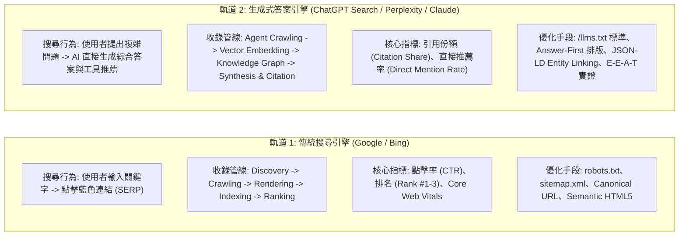
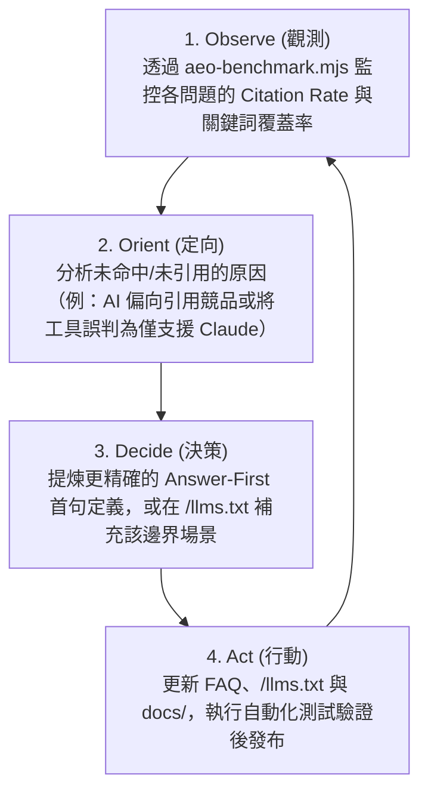

# `gemini-plugin-cc` 終極推廣、生態上架與架構交接手冊 (業界標準加固版)
(Master Playbook: Growth, MCP Registries, AI-Era SEO/AEO Architecture & Next-Gen Launch)

> **版本**：v3.6.0 (Enterprise, RFC 9309, Answer.AI Spec v2 & Codebase Ground-Truth Aligned)  
> **建立日期**：2026-08-21  
> **對齊標準**：RFC 9309 (Robots Exclusion Protocol)、Answer.AI `/llms.txt` Spec v2、OASIS SARIF 2.1.0、Schema.org SoftwareApplication & TechArticle、Google E-E-A-T 2026 Guidelines、OWASP Top 10 for LLM (2025/2026)、OpenSSF Best Practices、Claude Code Manifest Spec  
> **交接目標**：供維護團隊與 **Claude Code** 進行後續無縫實作、生態登錄、AI 時代搜尋最佳化與跨客戶端維運。  

---

## 1. 現況評估矩陣 (Current State Audit)

經代碼庫全面唯讀檢驗，專案現狀與外部平台要求的合規性如下：

| 檢驗項目 | 外部/業界標準要求 | 目前現狀 | 評估結論 | Claude 實作行動 |
|---|---|---|---|---|
| **開源許可證** | Public 倉庫需具備 `LICENSE` | 現為 MIT，v1.0.0 升級 Apache 2.0 | **過渡中** | v1.0.0 正式切換 (見第 9 節) |
| **MCP 啟動穩定性** | 沙盒 `initialize` 與 `tools/list` 不得崩潰 | `gemini-mcp.mjs` 為純記憶體回應，無啟動探測 | **合規 (Pass)** | 無需變動 |
| **Smithery 設定檔** | 根目錄需有 `smithery.yaml` 宣告啟動 | 尚未建立 | ⚠️ **待補齊** | 新增 `smithery.yaml` (見第 4.1 節) |
| **AEO 機器索引** | 根目錄需具備 `/llms.txt` 與 `/llms-full.txt` | 尚未建立 | ⚠️ **待補齊** | 實裝 `/llms.txt` 與建置腳本 (見第 4.6 節) |
| **AI 爬蟲權限** | `robots.txt` 需符合 RFC 9309 明確授權 AI 代理 | 尚未發布 | ⚠️ **待配置** | 部署生產級 `robots.txt` (見第 4.5 節) |
| **語意實體圖譜** | Schema.org `SoftwareApplication` JSON-LD | 尚未嵌入 | ⚠️ **待補齊** | 嵌入 JSON-LD 標記 (見第 4.7 節) |
| **模型命名邊界** | 支援 Vertex AI (`/`) 與版本標籤 (`@`) | 舊正則阻斷了 `/` 與 `@` | ⚠️ **待放寬** | 更新 `SAFE_MODEL_ID` (見第 6.2 節) |
| **Gate 安全合規** | CI/CD 環境需支援 Fail-Closed | 現狀為全域 Fail-Open | ⚠️ **待雙軌化** | 引入 `GEMINI_GATE_STRICT` (見第 6.1 節) |
| **CI 封裝標準** | 企業流水線需 1 行啟用 | 尚無 `action.yml` | ⚠️ **待補齊** | 新增 `action.yml` (見第 7.1 節) |
| **漏洞輸出標準** | OASIS SARIF 2.1.0 格式 | 現狀為自訂 JSON | ⚠️ **待支援** | 擴充 SARIF 輸出 (見第 7.2 節) |

---

## 2. 專案核心定位與價值主張 (Core Positioning)

```mermaid
graph TD
    User["開發者 (Claude Code / Cursor / CI Pipeline)"] --> Driver["主控端 (Claude / GitHub Actions)"]
    Driver -->|產生代碼與 Diff| Review["對抗性審查調度模組"]
    Review -->|跨模型漏洞獵捕| Gemini["Google Gemini 3.7 / 3.5 / 4<br>(百萬 Token 外部驗證沙盒)"]
    Review -->|邏輯歧見仲裁 (選配)| Arbiter["OpenAI o1 / o3<br>(形式化邏輯仲裁者)"]
    Gemini -->|輸出反思報告與攻擊面| Driver
    Arbiter -->|輸出最終共識裁決| Driver
    Driver -->|自主修補或阻斷 PR| Repo["專案代碼庫 / GitHub PR"]
```

* **品牌主張**：**「自適應多代理人閉環控制架構 (Adaptive Multi-Agent Closed-Loop Control Harness)」**。
* **工程三位一體分工 (The Engineering Triad)**：
  1. **Graph Engineering (圖拓撲)**：定義多模型有向圖路由，小變更走 Single-Agent 極速通道，大架構重構自適應分裂出衛星子代理群 (Subagents)。
  2. **Loop Engineering (控制閉環)**：將外部對抗反例轉化為形式化修復向量回傳給主控端，驅動自動補丁修復與 OODA 收斂，直至綠燈放行。
  3. **Harness Engineering (安全夾具)**：以 Gate 雙軌制（Fail-Open/Closed）、機密過濾與 OASIS SARIF 2.1.0 建立確定性安全護城河。
* **AI Safety 理論（共模故障防禦 Common-Mode Failure Defense）**：
  * 單一模型自我審查易陷入同構認知盲區。
  * 由主控端產出代碼、Gemini 進行超大上下文獵漏洞、OpenAI 進行形式化邏輯仲裁，是企業級資安的最佳實踐。
* **主從關係清晰**：主控端是唯一調度者，外部審查結果促成自我反思與修復，**直接提升會話深度與實質 Token 價值**。

---

## 3. 三大生態推進路徑與申報指引

### 3.1 登上 Anthropic 官方推薦 / 插件目錄
* **論述核心**：本插件是「Claude Code 的高階資安防護裝備」，嚴格遵循數據最小化（僅發送 Git Diff，絕不外洩 System Prompt 或專有會話歷史）。
* **交付物**：在倉庫建立 `SECURITY.md` 說明憑證隔離與安全邊界。

### 3.2 申請 OpenAI Codex for Open Source 資助 ([申請入口](https://openai.com/form/codex-for-oss/))
* **官方審核本質**：面向公開開源倉庫維護者，補助用於 PR 審查、CI/CD 與安全審計的 API 額度。
* **申請表最佳填寫範本**：
  * **Role**: Primary Maintainer of `gemini-plugin-cc`.
  * **Project Description**: An open-source multi-agent code review & adversarial consensus framework for developer workflows, originating from the `codex-plugin-cc` lineage.
  * **Intended Use of API Credits**:
    1. 在開源倉庫的 CI/CD 中運行「異質多模型交叉審查矩陣（Claude + Gemini + OpenAI o-series）」。
    2. 建置開放的《開源代碼審查基準 (Open-Source Multi-Agent Review Benchmark)》，評測異質模型協同降低 CVE 漏洞率的成效。

---

## 4. MCP 市集、跨客戶端與 AI 時代 SEO / AEO 全方位實裝指南

### 4.1 Smithery.ai 登錄設定 (`smithery.yaml`)
在倉庫根目錄新增 `smithery.yaml`，確保自動爬蟲能正確辨識與一鍵安裝：

```yaml
startCommand:
  type: stdio
  config:
    command: node
    args:
      - plugins/gemini/scripts/gemini-mcp.mjs
    env:
      GEMINI_ENGINE: auto
```

### 4.2 Glama.ai 與 AEO / GEO 部署
* **GitHub Pages 靜態站點**：啟用 GitHub Pages（路徑 `/docs`），將 `llms.txt` 發布至 `https://arcobaleno64.github.io/gemini-plugin-cc/llms.txt`。
* **高意圖關鍵詞替換**：
  * ❌ 避免：`Fix API key not valid in Gemini CLI`（吸引免洗維修流量）。
  *  主打：`Claude Code automated security review MCP`、`Cursor Gemini adversarial review`、`Multi-agent code audit MCP`。

### 4.3 跨客戶端支援矩陣 (GUI Clients: Cursor, Claude Desktop, Windsurf, Cline)
本專案的 6 個 MCP 工具完全支援非 Claude Code 的所有 GUI 客戶端：

| 功能類型 | Claude Code (CLI) | Cursor / Claude Desktop / Cline (GUI) |
|---|:---:|:---:|
| **6 個 MCP 工具**（`gemini_review`, `gemini_adversarial_review` 等） |  支援 |  **完全支援**（AI 於視窗中主動調用） |
| **手動斜線指令**（如 `/gemini:review`） |  支援 | ❌ 不支援（Claude Code 專屬語法） |
| **工作結束自動審查閘門**（Stop Gate Hook） |  支援 | ❌ 不支援（Claude Code 專屬 Hook） |

---

### 4.4 現代 SEO 與 AEO/GEO 雙軌戰略全景圖 (From Zero to Found on Google & Claim Your Spot in AI)

> **解構依據**：
> 1. 《From Zero to Found on Google: The SEO Survival Guide for the AI Era》 (`iE8Byp-mMsc`)
> 2. 《Claim Your Spot in AI's Recommendations Before 99% of People Understand AEO》 (`f4kc4qI1nUk`)

現代軟體與開源專案的傳播已徹底分裂為兩條平行軌道：



#### 傳統 SEO vs. 答案引擎 AEO 實戰差異對照表：

| 評估維度 | 傳統搜尋引擎 (Googlebot / SEO) | 生成式答案引擎 (ChatGPT / Perplexity / AEO) |
|---|---|---|
| **搜尋媒介** | Google / Bing 網頁搜尋框 | ChatGPT Search, Perplexity Pro, Claude Web, Google AI Overviews |
| **互動模式** | 索引藍色網址清單，由使用者自行點擊篩選 | AI 消化海量資訊後，直接合成結論並提供「引用角標 (Citations)」 |
| **流量型態** | 點擊跳轉至目標網站首頁或文章頁 | 直接在對話中被推薦、引用或作為 MCP 工具被 AI 自動調用 |
| **爬蟲格式偏好** | 完整 HTML DOM、CSS、SSR 渲染的 JavaScript 頁面 | 零雜訊、語義密集的 Markdown 文本、結構化 JSON-LD、`/llms.txt` |
| **內容排版法則** | 關鍵字密度、文章長度 (Word Count)、內外部反向連結 | **Answer-First (首句即答案)**、獨立無歧義段落、條列證據庫 |
| **權威信任標準** | Domain Authority (DA)、PageRank、外鏈數量 | **E-E-A-T (經驗/專業/權威/信任)**、可復現測試代碼、開源驗證標籤 |
| **收錄管線澄清** | Google AI Overviews 由標準 `Googlebot` 爬取渲染 | `Google-Extended` 僅控制基礎模型訓練，非 AI Overviews 爬蟲 |

---

### 4.5 生產級 `robots.txt` 與 AI 爬蟲矩陣配置 (RFC 9309 Compliant)

依據 RFC 9309 規範，特定 User-Agent 區塊**不繼承**通用規則，因此必須在各 AI 代理區塊完整配置 `Allow` 與 `Disallow`，杜絕敏感目錄外洩：

```text
# ==============================================================================
# Production robots.txt for gemini-plugin-cc & Triad-Flow Ecosystem
# Strictly Compliant with RFC 9309, Google Search, Bing, OpenAI & Anthropic Specs
# ==============================================================================

# ------------------------------------------------------------------------------
# 1. Default Policy for Standard Search Engines (Googlebot, Bingbot, Slurp, etc.)
# ------------------------------------------------------------------------------
User-agent: *
Allow: /
Allow: /llms.txt
Allow: /llms-full.txt
Allow: /docs/
Disallow: /node_modules/
Disallow: /.git/
Disallow: /dist/
Disallow: /scratch/
Disallow: /tests/

# ------------------------------------------------------------------------------
# 2. OpenAI Crawlers (Training, Real-time Search & Browsing)
# ------------------------------------------------------------------------------
User-agent: GPTBot
User-agent: OAI-SearchBot
User-agent: ChatGPT-User
Allow: /
Allow: /llms.txt
Allow: /llms-full.txt
Allow: /docs/
Disallow: /node_modules/
Disallow: /.git/
Disallow: /dist/
Disallow: /scratch/
Disallow: /tests/

# ------------------------------------------------------------------------------
# 3. Anthropic Claude Agents (Training & Real-time Web Retrieval)
# ------------------------------------------------------------------------------
User-agent: ClaudeBot
User-agent: Claude-Web
Allow: /
Allow: /llms.txt
Allow: /llms-full.txt
Allow: /docs/
Disallow: /node_modules/
Disallow: /.git/
Disallow: /dist/
Disallow: /scratch/
Disallow: /tests/

# ------------------------------------------------------------------------------
# 4. Perplexity AI Agents (Index & Real-time Live Retrieval)
# ------------------------------------------------------------------------------
User-agent: PerplexityBot
User-agent: Perplexity-User
Allow: /
Allow: /llms.txt
Allow: /llms-full.txt
Allow: /docs/
Disallow: /node_modules/
Disallow: /.git/
Disallow: /dist/
Disallow: /scratch/
Disallow: /tests/

# ------------------------------------------------------------------------------
# 5. Apple & Google AI Extended Crawlers (Model Training Controls)
# ------------------------------------------------------------------------------
User-agent: Google-Extended
User-agent: Applebot
User-agent: Applebot-Extended
Allow: /
Allow: /llms.txt
Allow: /llms-full.txt
Allow: /docs/
Disallow: /node_modules/
Disallow: /.git/
Disallow: /dist/
Disallow: /scratch/
Disallow: /tests/

# ------------------------------------------------------------------------------
# 6. Aggressive Scraper Policy (ByteDance Bytespider WAF Level Protection)
# ------------------------------------------------------------------------------
User-agent: Bytespider
Disallow: /

# ------------------------------------------------------------------------------
# 7. Sitemap Location Declaration (RFC 9309 Section 2.3)
# ------------------------------------------------------------------------------
Sitemap: https://arcobaleno64.github.io/gemini-plugin-cc/sitemap.xml
```

---

### 4.6 官方 `/llms.txt` 與 `/llms-full.txt` 規範實裝 (Answer.AI Spec v2 & Ground Truth)

依據 Jeremy Howard (Answer.AI) 規範與本專案 `gemini-mcp.mjs` 真實簽名，發布 `/llms.txt`：

#### 檔案：`/llms.txt` (輕量導航索引 - < 1,000 Tokens)
```markdown
# gemini-plugin-cc

> Multi-agent heterogeneous adversarial code review and task delegation harness for Claude Code, Cursor, and enterprise CI/CD workflows.

gemini-plugin-cc pairs AI coding agents (Claude Code, Cursor, Claude Desktop) with Google Gemini's 1M-token context window and Antigravity CLI (AGY). It enables multi-agent adversarial code reviews, automated diff auditing, and background task delegation without sharing proprietary conversation logs.

## Core Documentation & Guides
- [Security Architecture](https://github.com/arcobaleno64/gemini-plugin-cc/blob/main/SECURITY.md): Capability security, zero session leakage, and credential path isolation.
- [Threat Model](https://github.com/arcobaleno64/gemini-plugin-cc/blob/main/docs/THREAT-MODEL.md): In-depth risk model and path boundary controls.
- [Engine Parity & Comparison](https://github.com/arcobaleno64/gemini-plugin-cc/blob/main/docs/COMPARISON.md): Gemini CLI vs Antigravity CLI (AGY) feature matrix.

## MCP Tools Reference (Stdio Server: `gemini-mcp.mjs`)
- `gemini_review`: Queue a read-only pragmatic code review over current git diff. Inputs: `workspace` (required string), `base` (string), `scope` ("auto"|"working-tree"|"branch"), `deep` (boolean), `model` (string), `engine` ("auto"|"gemini"|"agy"), `timeout` (integer). Returns: Enqueued job object with `jobId`.
- `gemini_adversarial_review`: Queue a read-only adversarial red-team review challenging design decisions and hunting CVEs. Inputs: `workspace` (required string), `focus` (string), `base` (string), `scope` ("auto"|"working-tree"|"branch"), `deep` (boolean), `model` (string), `engine` ("auto"|"gemini"|"agy"), `timeout` (integer). Returns: Enqueued job object with `jobId`.
- `gemini_rescue`: Queue a delegated task to Gemini/AGY. Inputs: `workspace` (required string), `prompt` (required string), `write` (boolean, default false), `effort` ("none"|"minimal"|"low"|"medium"|"high"|"xhigh"), `model` (string), `engine` ("auto"|"gemini"|"agy"), `timeout` (integer). Returns: Enqueued job object with `jobId`.
- `gemini_job_status`: Check runtime state of an enqueued companion job. Inputs: `workspace` (required string), `jobId` (required string). Returns: Job status object (`status`: queued|running|completed|failed|cancelled|partial).
- `gemini_job_result`: Read final output of a completed or partial job. Inputs: `workspace` (required string), `jobId` (required string). Returns: Stored markdown/json findings and output logs.
- `gemini_job_cancel`: Cancel an active job process tree. Inputs: `workspace` (required string), `jobId` (required string). Returns: Cancellation confirmation.

## Installation & Configuration
- [Quick Start & Setup](https://github.com/arcobaleno64/gemini-plugin-cc#quick-start): Run `agy` once for OAuth, or export `GEMINI_API_KEY`.
- [Claude Code Plugin](https://github.com/arcobaleno64/gemini-plugin-cc#installation): Run `/plugin install gemini-plugin-cc`.
- [Cursor & Claude Desktop MCP](https://github.com/arcobaleno64/gemini-plugin-cc#mcp-tools): Register `node plugins/gemini/scripts/gemini-mcp.mjs` in MCP config.

## Optional
- [Full Documentation Bundle](https://arcobaleno64.github.io/gemini-plugin-cc/llms-full.txt): Concatenated documentation for single-shot ingestion.
- [Changelog](https://github.com/arcobaleno64/gemini-plugin-cc/blob/main/plugins/gemini/CHANGELOG.md): Historical version releases and updates.
```

#### 檔案：`/llms-full.txt` 聚合建置管線 (`package.json`)
在 `package.json` 中配置具備路徑備援與換行正規化的跨平台建置指令：
```json
{
  "scripts": {
    "build:llms-full": "node -e \"const fs=require('fs'); const candidates=['README.md','SECURITY.md','docs/SECURITY.md','PRIVACY.md','docs/THREAT-MODEL.md','docs/COMPARISON.md']; const files=candidates.filter(f=>fs.existsSync(f)); if(!files.length) throw new Error('No files found'); fs.mkdirSync('docs',{recursive:true}); const content=files.map(f=>'# File: '+f+'\\n\\n'+fs.readFileSync(f,'utf8').replace(/\\r\\n/g,'\\n').trim()).join('\\n\\n---\\n\\n')+'\\n'; fs.writeFileSync('docs/llms-full.txt',content,'utf8'); console.log('✔ Generated docs/llms-full.txt ('+files.length+' files, '+Buffer.byteLength(content)+' bytes)');\""
  }
}
```

---

### 4.7 結構化資料 JSON-LD 與語意知識圖譜標記 (Google Rich Results 合規)

在官方網站與 GitHub Pages 首頁 `<head>` 區域嵌入標準 JSON-LD，雙型別宣告 `SoftwareApplication` + `SoftwareSourceCode`，並補齊 `image`、`mainEntityOfPage` 與 `about` 實體錨定：

```html
<script type="application/ld+json">
{
  "@context": "https://schema.org",
  "@graph": [
    {
      "@type": ["SoftwareApplication", "SoftwareSourceCode"],
      "@id": "https://arcobaleno64.github.io/gemini-plugin-cc/#software",
      "name": "gemini-plugin-cc",
      "alternateName": "Triad-Flow Gemini Companion",
      "description": "Multi-agent heterogeneous adversarial code review and closed-loop control harness for Claude Code, Cursor, and enterprise CI/CD pipelines.",
      "applicationCategory": "DeveloperApplication",
      "operatingSystem": "Windows, macOS, Linux",
      "softwareVersion": "1.0.0",
      "license": "https://www.apache.org/licenses/LICENSE-2.0",
      "url": "https://arcobaleno64.github.io/gemini-plugin-cc/",
      "codeRepository": "https://github.com/arcobaleno64/gemini-plugin-cc",
      "programmingLanguage": "JavaScript",
      "runtimePlatform": "Node.js >= 18",
      "offers": {
        "@type": "Offer",
        "price": "0",
        "priceCurrency": "USD",
        "availability": "https://schema.org/InStock"
      },
      "author": {
        "@type": "Person",
        "@id": "https://github.com/arcobaleno64",
        "name": "arcobaleno64",
        "url": "https://github.com/arcobaleno64"
      }
    },
    {
      "@type": "TechArticle",
      "@id": "https://arcobaleno64.github.io/gemini-plugin-cc/#architecture",
      "mainEntityOfPage": "https://arcobaleno64.github.io/gemini-plugin-cc/",
      "about": {
        "@id": "https://arcobaleno64.github.io/gemini-plugin-cc/#software"
      },
      "headline": "Heterogeneous Multi-Agent Closed-Loop Control Architecture for AI Code Review",
      "description": "How cross-model adversarial review between Claude, Gemini, and OpenAI eliminates common-mode failure in automated software engineering.",
      "image": "https://arcobaleno64.github.io/gemini-plugin-cc/assets/og-image.png",
      "author": {
        "@type": "Person",
        "@id": "https://github.com/arcobaleno64",
        "name": "arcobaleno64",
        "url": "https://github.com/arcobaleno64"
      },
      "publisher": {
        "@type": "Organization",
        "name": "Triad-Flow Open Source Initiative",
        "url": "https://github.com/arcobaleno64",
        "logo": {
          "@type": "ImageObject",
          "url": "https://arcobaleno64.github.io/gemini-plugin-cc/assets/logo.png"
        }
      },
      "datePublished": "2026-08-20",
      "dateModified": "2026-08-21",
      "proficiencyLevel": "Expert"
    }
  ]
}
</script>
```

---

### 4.8 E-E-A-T 權威性注入與 Answer-First 高引用率 FAQ 庫

#### 🎯 Answer-First 內容排版黃金準則：
AI 答案引擎（ChatGPT / Perplexity / Claude）在生成綜合回答時，會優先引用「**問題標題下方第一句話即給出精確、無歧義定義**」的內容區塊。

#### Q1: What is `gemini-plugin-cc` and how does it improve Claude Code?
> **`gemini-plugin-cc` is an open-source multi-agent code review harness that pairs Claude Code with Google Gemini's 1M-token context window to perform heterogeneous adversarial security reviews.** While Claude generates and edits code, Gemini acts as an external auditor hunting subtle vulnerabilities, API edge cases, and structural regressions without sharing proprietary session histories.

#### Q2: Why is heterogeneous multi-agent review superior to single-model review?
> **Heterogeneous review eliminates common-mode cognitive failure by ensuring that the AI generating the code is not the same model auditing it.** Single-model self-review suffers from isomorphic blindspots where an LLM rationalizes its own hallucinations; pairing Claude with Gemini and OpenAI ensures cross-model Byzantine validation and objective consensus.

#### Q3: How do you configure `gemini-plugin-cc` in Cursor and Claude Desktop using MCP?
> **You can configure `gemini-plugin-cc` in any MCP-compatible GUI by registering its stdio command with an absolute path in `claude_desktop_config.json` or Cursor's MCP Settings.**
```json
{
  "mcpServers": {
    "gemini-plugin-cc": {
      "command": "node",
      "args": ["<ABSOLUTE_PATH_TO_REPO>/plugins/gemini/scripts/gemini-mcp.mjs"],
      "env": {
        "GEMINI_ENGINE": "auto"
      }
    }
  }
}
```

#### Q4: How does Triad-Flow resolve conflicting findings between AI models?
> **Triad-Flow uses deterministic quorum aggregation policies that preserve the highest reported severity to prevent vulnerability downgrade attacks.** If external adversarial review (Gemini) reports a Critical vulnerability while the local model reports a Low issue, the consensus policy strictly enforces the Critical rating and triggers fail-closed gate blocking.

#### Q5: Can `gemini-plugin-cc` run in enterprise CI/CD pipelines with SARIF export?
> **Yes, `gemini-plugin-cc` supports enterprise CI/CD with 1-line GitHub Actions composite workflows and OASIS SARIF 2.1.0 exports.** In CI pipelines, setting `GEMINI_GATE_STRICT=true` enforces fail-closed blocking on any critical findings, automatically uploading findings to GitHub Code Scanning.

#### Q6: What are the security, privacy, and data minimization guarantees?
> **`gemini-plugin-cc` strictly adheres to data minimization by transmitting only Git Diffs, never exposing user system prompts, credentials, or proprietary conversation logs.** Furthermore, it enforces file-level secret isolation by automatically intercepting known credential paths (`.env*`, `*.pem`, `*.key`, `credentials.json`, `id_rsa`) and redacting their diff content before payload transmission.

#### Q7: What open-source license governs `gemini-plugin-cc` and its derivative forks?
> **`gemini-plugin-cc` is transitioning to the enterprise-grade Apache License 2.0 starting with the v1.0.0 release, providing users with explicit patent grants and trademark protection.** Downstream contributors and commercial adopters benefit from mutual patent retaliation safeguards while maintaining commercial flexibility.

---

### 4.9 SEO / AEO / GEO 自動化驗證、指標監控與持續改進閉環 (Automated Verification & Continuous Improvement Loop)

為了確保發布後的 SEO / AEO / GEO 規格不發生語意漂移、格式回歸或鏈路損壞，並能依據量化數據反饋持續調優，本專案建立了 **「CI/CD 自動化測試 + 定時 AEO 基準評測 + OODA 持續改進閉環」**：

#### 1. CI/CD 靜態規格自動化驗證 (`tests/seo-aeo-validation.test.mjs`)
在每次 Pull Request 或版本發布時自動執行，100% 阻斷規格回歸：
```bash
node --test tests/seo-aeo-validation.test.mjs
```
* **驗證範疇**：
  1. `robots.txt`：RFC 9309 語法、12 大 Agent 群組非繼承隔離、敏感目錄（`/.git/`, `/scratch/`, `/dist/`）阻斷。
  2. `/llms.txt`：Answer.AI Spec v2 單一 H1/Blockquote/`## Optional`、6 大真實 MCP 工具簽名覆蓋。
  3. `Schema.org JSON-LD`：雙型別聲明、Google Rich Results 必填項（`image`, `publisher` logo, `about` DAG 鏈路）。
  4. `Answer-First FAQ`：7 大問答首句定義完整度、機密路徑真實性（`.env*`, `credentials.json`）。

#### 2. 自動化 AEO 基準評測與統計指標生成器 (`scripts/aeo-benchmark.mjs`)
評分器，輸入是**真實助理回應**：把 `BENCHMARK_QUERIES` 裡的提問逐字丟給助理，把回答原文存進
`bench/aeo-responses/<QUERY_ID>.md`，腳本才有東西可算。

```bash
node scripts/aeo-benchmark.mjs
```

* **輸入**：`bench/aeo-responses/`，一題一檔，首行必須是 provenance 註解
  （`<!-- captured: YYYY-MM-DD | assistant: 名稱 -->`），否則腳本拒絕評分而非給分。
* **輸出報表**：`docs/benchmarks/latest-aeo-report.json`（產生物，已列入 `.gitignore`）。
* **未擷取的題目記為 unmeasured，不計入任何比率**，也不當成 0 分——沒問過助理和助理答不好
  是兩件事。報表另列 `benchmarkQueries` 與 `unmeasured` 清單。
* **不產出趨勢**：單次擷取是「某個助理在某一天的某一個回答」，不構成時間序列。要談趨勢，
  得有多次不同日期的擷取。

#### 3. 四大核心監控 KPI 與統計指標 (Statistical Metrics & KPIs)

| 核心 KPI 指標 | 定義與計算公式 | 目標門檻 (SLA) | 監控與採集方式 |
|---|---|:---:|---|
| **1. 引用涵蓋率 (Citation Inclusion Rate)** | $\frac{\text{被 AI 引用次數 (含有官方 URL)}}{\text{已擷取回應的提問數}} \times 100\%$ | **$\ge 80\%$** | `scripts/aeo-benchmark.mjs`，分母為已擷取題數 |
| **2. 首選直接推薦率 (Direct Recommendation)** | $\frac{\text{AI 答案首段直接推薦本工具次數}}{\text{已擷取回應的提問數}} \times 100\%$ | **$\ge 75\%$** | 答案文本正則比對 (`gemini-plugin-cc` / `triad-flow`) |
| **3. 語意關鍵詞覆蓋度 (Average Keyword Coverage)**| $\frac{1}{N}\sum \frac{\text{命中核心技術關鍵詞數}}{\text{目標關鍵詞總數}} \times 100\%$ | **$\ge 60\%$** | 評估 AI 綜合回答是否保留「異質對抗、1M 上下文、數據最小化」 |
| **4. 結構化資料合規率 (Schema Compliance Score)** | $\frac{\text{Google Rich Results 綠燈無重大錯誤數}}{\text{總頁面數}} \times 100\%$ | **$100\%$** | Google Search Console / Rich Results API |

#### 4. AEO 持續改進 OODA 反饋閉環 (Continuous Improvement Feedback Loop)



---

## 5. 前置環境依賴與異常防禦機制 (Prerequisites & Failure Modes)

### 5.1 本機依賴條件
* **Node.js**：`>= 18.0.0`
* **Google 引擎**：已安裝 `agy.exe` (Antigravity CLI) 或 `gemini` CLI（或環境變數設定 `GOOGLE_API_KEY`）。

### 5.2 GUI 使用者無 Node.js 時的行為特徵
* **現象**：當使用者電腦未安裝 Node.js 時，GUI 軟體啟動 MCP 伺服器會直接失敗並拋出 `spawn node ENOENT`（找不到檔案）。
* **介面表現**：Cursor MCP 面板顯示紅燈（`Error: spawn node ENOENT`）；Claude Desktop 提示連線失敗。
* **防護機制**：README 首屏置頂標註 `Prerequisites: Node.js >= 18`。

### 5.3 README 認證指引視覺化優化建議 (Actionable Visual Callout)
* **現狀問題**：目前 `README.md` 與 `README.zh-TW.md` 的認證指引包在長篇段落中，掃描型開發者容易忽略「需執行一次 `agy` 完成授權」或「可設定 `GEMINI_API_KEY`」。
* **優化建議**：在 `README.md` 的 `## Quick Start` 最上方置入 3 秒可讀的「步驟 0 認證代碼塊」：
  ```markdown
  ### Step 0: Authentication (Pick one)
  ```bash
  # Option A: Google Account OAuth (run once interactively)
  agy

  # Option B: API Key (headless / automated CI/CD workflows)
  export GEMINI_API_KEY="your-api-key"
  ```
  ```

---

## 6. 架構安全與代碼加固規格（Claude Code 實作指引）

> [!IMPORTANT]
> **給 Claude Code 的實作防漂移守則 (Premortem Guardrails)**：
> 1. **維持現有函式簽名與測試契約**：`allocateBudget(sizes, budget)` 為匯出的純運算函式（以數字陣列為輸入），**嚴禁修改其參數簽名**，以免破壞 `tests/git.test.mjs`。
> 2. **Vertex AI 多層路徑支援**：Vertex AI 模型路徑包含多個斜線（如 `publishers/google/models/gemini-3.5-pro`），正則必須支援**多層斜線**而非單一斜線。
> 3. **複用而非重建**：`doctor` 自檢應擴充既有的 `buildSetupReport` / `handleSetup`，切勿新建平行衝突模組。

### 6.1 Gate 雙軌制（本機 Fail-Open + CI Fail-Closed）
* **檔案**：`plugins/gemini/scripts/stop-review-gate-hook.mjs`
* **精確實作邏輯**：在 `if (!payload)` 分支中（約 line 109）引入 `GEMINI_GATE_STRICT` 判斷。

### 6.2 `SAFE_MODEL_ID` 正則放寬（支援多層 Vertex AI 與版本標籤）
* **檔案**：`plugins/gemini/scripts/lib/engine.mjs`
* **精確正則定義**：
  ```javascript
  const SAFE_MODEL_ID = /^(?:[A-Za-z0-9_.-]+\/)*[A-Za-z0-9][A-Za-z0-9._-]*(?:@[A-Za-z0-9._-]+)?$/;
  ```

### 6.3 智慧安全加權預算分配 (Security-Weighted Budgeting)
* **檔案**：`plugins/gemini/scripts/lib/git.mjs`
* **實作位置**：在 `budgetReviewSections` 中對 `units` 進行安全加權排序（Tier 1: Auth/Workflows, Tier 2: Source Code, Tier 3: Docs/JSON）。

### 6.4 `doctor` 輕量一鍵診斷指令
* **檔案**：`plugins/gemini/scripts/gemini-companion.mjs`
* **實作方式**：在 `handleSetup` / `buildSetupReport` 擴充輸出診斷摘要。

---

## 7. 企業級 CI/CD 與業界標準整合規格 (Enterprise Standards)

### 7.1 GitHub Action 官方封裝規格 (`action.yml`)
為了讓企業 DevOps 團隊能以 3 行 YAML 直接嵌入 GitHub Actions，需在倉庫根目錄建立 `action.yml`：

```yaml
name: 'Gemini Adversarial Code Review'
description: 'Enterprise-grade heterogeneous adversarial code review using Gemini and Claude'
author: 'arcobaleno64'
inputs:
  engine:
    description: 'Engine to use (gemini | agy)'
    default: 'gemini'
    required: false
  strict:
    description: 'Fail-closed on review errors or quota limits'
    default: 'true'
    required: false
  output-format:
    description: 'Output format (json | markdown | sarif)'
    default: 'markdown'
    required: false
runs:
  using: 'composite'
  steps:
    - name: Set up Node.js
      uses: actions/setup-node@v4
      with:
        node-version: '>=18'
    - name: Run Adversarial Review
      shell: bash
      env:
        GEMINI_GATE_STRICT: ${{ inputs.strict }}
        GEMINI_ENGINE: ${{ inputs.engine }}
      run: |
        node plugins/gemini/scripts/gemini-companion.mjs review --base ${{ github.event.pull_request.base.sha || 'HEAD~1' }} --deep --json > review-result.json
```

### 7.2 OASIS SARIF 2.1.0 結構化標準輸出
企業級 CI/CD 依賴 **SARIF 2.1.0 (Static Analysis Results Interchange Format)** 與 GitHub Code Scanning / SonarQube 對接：
* **實作位置**：`plugins/gemini/scripts/lib/render.mjs`
* **格式定義**：
  ```json
  {
    "$schema": "https://raw.githubusercontent.com/oasis-tcs/sarif-spec/master/Schemata/sarif-schema-2.1.0.json",
    "version": "2.1.0",
    "runs": [
      {
        "tool": {
          "driver": {
            "name": "gemini-adversarial-review",
            "version": "0.23.0"
          }
        },
        "results": [
          {
            "ruleId": "AI-ADVERSARIAL-FINDING",
            "level": "error",
            "message": { "text": "Potential authentication bypass detected in auth.ts" },
            "locations": [
              {
                "physicalLocation": {
                  "artifactLocation": { "uri": "src/auth.ts" },
                  "region": { "startLine": 42 }
                }
              }
            }
          }
        ]
      }
    ]
  }
  ```

### 7.3 OpenSSF 合規性文檔 (`SECURITY.md`)
建立 `SECURITY.md` 明定安全通報窗口、漏洞回應時間（SLA）與機密防護保證，符合企業 SOC2 與 OpenSSF 開源安全標準。

---

## 8. Gemini 3.5 Pro / Gemini 4「Day 0」發布 SOP

1. **[0-5 分鐘] 別名更新**：
   * 編輯 `plugins/gemini/scripts/lib/model-map.mjs`，將 `pro` / `flash` 別名與 `EFFORT_MODEL_MAP` 指向官方新 Model ID。
2. **[5-10 分鐘] 執行本機測試**：
   * `node --test tests/model-map.test.mjs`
3. **[10-20 分鐘] 產生實測 Findings 並發布 Release**：
   * 對範例庫跑一次 `/gemini:adversarial-review`，截取真實對抗審查報告。
   * 發布 GitHub Release `v0.23.0 - Day-0 Gemini 4 Adversarial Review in Claude Code`。
4. **[20-30 分鐘] 社群技術廣播**：
   * 在 Reddit (`r/ClaudeAI`) 與 X 發布實測案例長文，帶動真實開發者安裝與轉化。

---

## 9. 開源授權策略與 v1.0.0 升級時機 (Open Source Licensing Strategy & v1.0.0 Roadmap)

### 9.1 授權升級策略：從 MIT 邁向 Apache-2.0
本專案現階段（v0.22.x）使用 MIT 授權以降低初期開發者上手摩擦力。自 **v1.0.0 正式版** 起，全面升級為 **Apache-2.0** 授權，與上游 `openai/codex-plugin-cc` 及下游 `Triad-Flow` 保持 100% 法律血統一致性。

### 9.2 Apache-2.0 賦予維護者的「三大法律護城河」
1. **🛡️ 專利免死金牌 (Grant of Patent License - Section 3)**：
   * 所有貢獻者與作者承諾將代碼涉及之專利免費、永久授權給使用者，杜絕大廠「釣魚式開源」風險。
2. **⚡ 專利報復條款 (Patent Retaliation Clause - Section 3)**：
   * 建立「核威懾防禦」：任何第三方若針對本軟體向維護者提起專利侵權訴訟，該第三方使用本專案的所有開源授權立即自動終止。
3. **🏷️ 商標免責盾牌 (Trademarks - Section 6)**：
   * 嚴格禁止第三方在魔改代碼後擅自使用專案名稱、作者名義或商標進行背書或宣傳，防止惡意木馬假冒官方插件。

### 9.3 對下游 Fork 與商業使用者的影響
* **零商業阻礙**：Apache-2.0 依然屬於寬鬆開源授權（Permissive），下游依然可以自由商用、修改與閉源分發（絕非 GPL 傳染性授權）。
* **下游獲專利保護**：下游 Fork 同樣受到專利免死金牌保護，免除侵權後顧之憂。
* **不溯及既往**：v1.0.0 以前的歷史 Fork 保持當時的 MIT 條款，自 v1.0.0 起的新提交全面納入 Apache-2.0 雙向保護。

### 9.4 升級為 Apache-2.0 的「4 大黃金時機點」

| 時機點 | 觸發條件 / 里程碑 | 策略優勢 |
|---|---|---|
| 🏆 **時機 1：v1.0.0 GA 正式發布日 (最推薦)** | 專案完成 Gate 雙軌制、SARIF 2.1.0 與全套測試，宣告進入 Production-Ready 階段。 | 遵循 SemVer 慣例，從 0.x 邁入 1.0.0 代表企業級穩定性承諾，此時宣告升級企業級授權最自然、阻力最小。 |
| 📝 **時機 2：正式提交 OpenAI / 企業級 Grant 申請前夕** | 準備送出 OpenAI Codex for Open Source 或開源基金會資助表單時。 | 評審機構重視專利清晰度與智財權防護，Apache-2.0 能大幅提升企業評審的合規信任度。 |
| 🔄 **時機 3：與 Triad-Flow 矩陣深度整合發布時** | `gemini-plugin-cc` 與 `Triad-Flow` 母架構完成適配器對接時。 | 全生態體系（中央大腦 + 引擎外掛）統一為 Apache-2.0，消除跨倉庫授權碎片化。 |
| 🚀 **時機 4：Gemini 4 / Day-0 大模型引發流量暴增前** | 官方重大模型發表，預期將湧入大量 GitHub Stars 與 Forks 前。 | 在大量外部 Fork 產生前鎖定專利與商標防護，確保核心資產不被惡意挪用。 |
